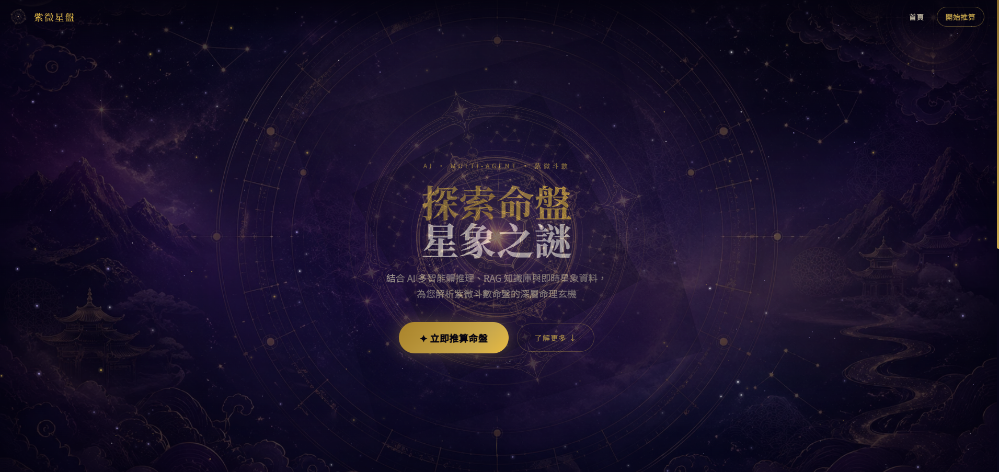
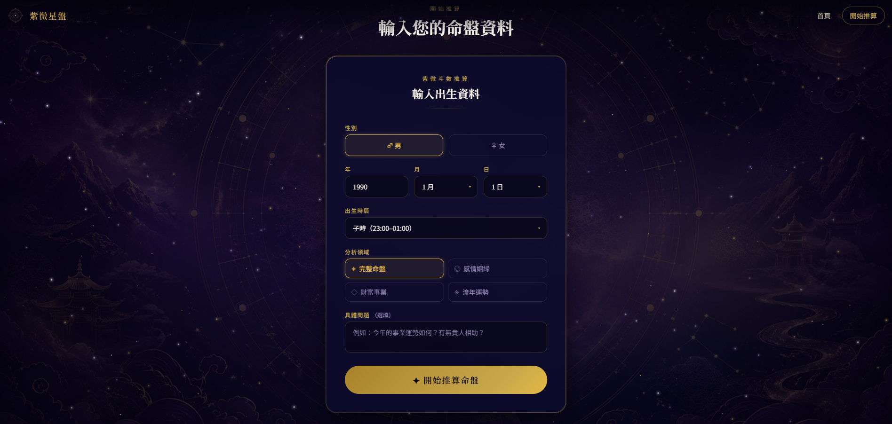
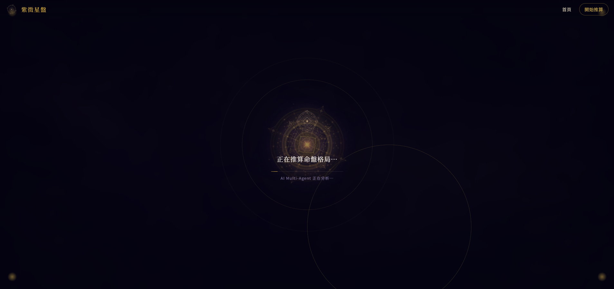
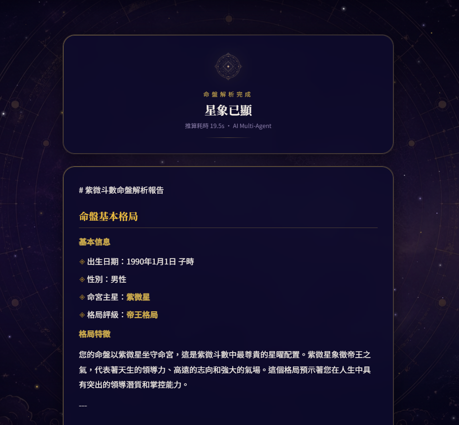

# 🔮 紫微斗數 Multi-Agent AI 系統

[](https://github.com/Tsai1030/Full-multi-agent)
[](https://opensource.org/licenses/MIT)
[](https://www.python.org/downloads/)
[](https://nextjs.org/)
[](https://fastapi.tiangolo.com/)
[](https://langchain-ai.github.io/langgraph/)

> 基於 **LangGraph ReAct Loop** 的 Graph Multi-Agent 紫微斗數 AI 分析系統。
> 結合自訂 Python MCP Server、ChromaDB RAG 知識庫與 Web Search，提供深度命理分析體驗。

---

## 📸 系統展示

| 首頁 | 輸入資料 |
|------|---------|
|  |  |

| 分析載入 | 分析結果 |
|---------|---------|
|  |  |

---

## 🏗️ 系統架構

```
┌─────────────────────────────────────────────────────────────┐
│                    Frontend (Next.js 14)                     │
│           TypeScript · Tailwind CSS · Framer Motion         │
└──────────────────────────┬──────────────────────────────────┘
                           │ HTTP /api/analyze
┌──────────────────────────▼──────────────────────────────────┐
│                  FastAPI  (port 8000)                        │
│  ┌─────────────────────────────────────────────────────┐    │
│  │              LangGraph StateGraph                    │    │
│  │                                                      │    │
│  │   START → orchestrator ──┐                          │    │
│  │               ▲          │ tool_calls?              │    │
│  │               │ loop     ▼                          │    │
│  │             tools ◄──────┘                          │    │
│  │               │  max_iterations                     │    │
│  │               ▼                                     │    │
│  │          synthesizer → END                          │    │
│  └──────┬───────────┬──────────┬───────────────────────┘    │
│         │           │          │                             │
│    web_search   rag_tool   mcp_bridge                       │
│    (Tavily/    (ChromaDB)  (MCP Client)                     │
│     DuckDuckGo)            │                                │
│                    ┌───────▼───────┐                        │
│                    │  MCP Server   │ /mcp/*                 │
│                    │ (Sub-App)     │                        │
│                    │ ZiweiChartTool│                        │
│                    │ → windada.com │                        │
│                    └───────────────┘                        │
└─────────────────────────────────────────────────────────────┘
```

---

## ✨ 核心特色

### 🤖 LangGraph ReAct Loop
- **Graph-based** 多智能體架構，取代傳統線性 pipeline
- **ReAct 模式**：Reason → Act → Observe 循環，自主決策工具使用順序
- **動態路由**：根據工具呼叫結果決定繼續 loop 或進入 synthesizer
- **迭代上限保護**：防止無限循環，確保回應時間可控

### 🛠️ 自訂 Python MCP Server
- 完全取代舊版 Node.js MCP server
- FastAPI sub-application，掛載於主 app 的 `/mcp` 路徑
- `BaseMCPTool` ABC 抽象類別，支援快速擴充新工具
- `ToolRegistry` 管理工具註冊與呼叫

### 📚 RAG 知識檢索
- **ChromaDB** 持久化向量資料庫
- **OpenAI text-embedding-3-small** 嵌入模型
- 啟動時自動索引（idempotent，不重複建立）
- 紫微斗數專業知識庫（JSON chunks 格式）

### 🌐 Web Search
- 主要使用 **Tavily Search API**
- 自動 fallback 至 **DuckDuckGo**（免費備援）

### 🎨 現代化前端
- **Next.js 14 App Router** + TypeScript
- Canvas **StarField** 粒子動畫
- **Framer Motion** 頁面轉場與 stagger 動畫
- 神秘星象主題設計，全螢幕載入覆蓋效果

---

## 📁 專案結構

```
Full-multi-agent/
├── backend/
│   ├── api_server.py              # FastAPI 主程式，lifespan 自動建立 RAG
│   ├── requirements.txt
│   ├── .env                       # 環境變數（不納入 git）
│   └── src/
│       ├── config/
│       │   └── settings.py        # Pydantic-settings 單一 flat 設定
│       ├── mcp/
│       │   ├── server.py          # MCP FastAPI sub-app
│       │   ├── client.py          # 非同步 HTTP MCPClient
│       │   └── tools/
│       │       ├── base.py        # BaseMCPTool ABC + ToolResult
│       │       ├── registry.py    # ToolRegistry 單例
│       │       └── ziwei.py       # ZiweiChartTool（爬取 windada.com）
│       ├── rag/
│       │   ├── vector_store.py    # ZiweiVectorStore（ChromaDB）
│       │   ├── indexer.py         # RAGIndexer（首次啟動建索引）
│       │   ├── retriever.py       # RAGRetriever（語意搜尋）
│       │   └── embeddings.py      # OpenAI embedding provider
│       ├── tools/
│       │   ├── web_search.py      # @tool web_search（Tavily + DDG）
│       │   ├── rag_tool.py        # @tool search_ziwei_knowledge
│       │   └── mcp_bridge.py      # @tool get_ziwei_chart（→ MCP）
│       ├── graph/
│       │   ├── state.py           # GraphState TypedDict
│       │   ├── nodes.py           # orchestrator / tool_node / synthesizer
│       │   ├── edges.py           # should_continue 條件邊
│       │   └── builder.py         # StateGraph 編譯（lru_cache 單例）
│       └── api/
│           ├── models.py          # Pydantic 請求/回應模型
│           └── router.py          # /api/analyze, /api/status, /api/domains
│
└── frontend/
    ├── next.config.js             # API 代理 rewrite
    ├── tailwind.config.ts         # 自訂 cosmos/gold/mystic 色票與動畫
    ├── src/
    │   ├── app/
    │   │   ├── layout.tsx         # Google Fonts、metadata
    │   │   ├── page.tsx           # 首頁（Hero + DomainCards）
    │   │   └── analyze/
    │   │       └── page.tsx       # form → loading → result 狀態機
    │   ├── components/
    │   │   ├── StarField.tsx      # Canvas 星空粒子動畫
    │   │   ├── CosmicBackground.tsx
    │   │   ├── Navbar.tsx
    │   │   ├── HeroSection.tsx    # 雙向旋轉星盤 + 展開環動畫
    │   │   ├── DomainCards.tsx    # 四大領域卡片
    │   │   ├── BirthDataForm.tsx  # 出生資料輸入表單
    │   │   ├── DivinationLoader.tsx # 全螢幕占卜載入覆蓋
    │   │   ├── ResultDisplay.tsx  # Markdown 結果展示
    │   │   └── ui/
    │   │       ├── Button.tsx
    │   │       └── GoldSelect.tsx
    │   ├── hooks/
    │   │   └── useAnalysis.ts     # 分析狀態機 hook（AbortController）
    │   ├── lib/
    │   │   ├── api.ts
    │   │   └── constants.ts
    │   └── types/
    │       └── index.ts
    └── public/
        ├── background.png
        ├── icon.png
        ├── icon2.png
        └── screenshots/
```

---

## 🚀 快速開始

### 環境需求

| 工具 | 版本 |
|------|------|
| Python | 3.11+ |
| Node.js | 18+ |
| uv | 最新版 |
| Yarn | 1.x |

### 1. 複製專案

```bash
git clone https://github.com/Tsai1030/Full-multi-agent.git
cd Full-multi-agent
```

### 2. 後端設定

```bash
cd backend

# 建立虛擬環境（使用 uv 管理）
uv venv --python 3.11 --python-preference managed
.venv\Scripts\activate   # Windows
# source .venv/bin/activate  # macOS/Linux

# 安裝依賴
uv pip install -r requirements.txt
```

建立 `.env` 檔案：

```env
# 必填
ANTHROPIC_API_KEY=sk-ant-...
OPENAI_API_KEY=sk-proj-...
ANTHROPIC_MODEL=claude-haiku-4-5-20251001

# 選填（Web Search）
TAVILY_API_KEY=tvly-...

# RAG 資料路徑
RAG_DATA_PATH=C:/path/to/zi_wei_dou_shu_rag_chunks.json

# 服務設定（預設值）
APP_HOST=0.0.0.0
APP_PORT=8000
APP_DEBUG=false
CORS_ORIGINS=http://localhost:3000
```

啟動後端（首次啟動會自動建立 RAG 向量庫）：

```bash
python api_server.py
```

### 3. 前端設定

```bash
cd frontend

# 安裝依賴
yarn install

# 啟動開發伺服器
yarn dev
```

### 4. 訪問系統

| 服務 | URL |
|------|-----|
| 前端 | http://localhost:3000 |
| 後端 API | http://localhost:8000 |
| Swagger UI | http://localhost:8000/docs |
| MCP Tools | http://localhost:8000/mcp/tools |

---

## 🔮 使用流程

1. 前往 http://localhost:3000
2. 點擊「開始推算」或選擇分析領域
3. 填入出生資料：性別、年月日、時辰
4. 選擇分析領域：愛情 / 財富 / 未來 / 綜合
5. 輸入選填問題（針對特定疑問）
6. 等待 AI 分析（LangGraph ReAct loop 執行中）
7. 查看深度命理分析結果

### 分析領域

| 領域 | 說明 |
|------|------|
| 💕 愛情感情 | 桃花運、感情運勢、婚姻分析 |
| 💰 財富事業 | 財運分析、事業發展、職業規劃 |
| 🔮 未來運勢 | 大限流年、人生規劃、趨勢預測 |
| 🌟 綜合分析 | 全方位命盤解析、整體運勢 |

---

## ⚙️ 進階設定

### Graph 參數

```env
GRAPH_MAX_ITERATIONS=6     # ReAct loop 最大迭代次數
GRAPH_RECURSION_LIMIT=25   # LangGraph recursion limit
```

### RAG 參數

```env
RAG_TOP_K=5                # 語意搜尋返回結果數
RAG_MIN_SCORE=0.3          # 最低相似度門檻
OPENAI_EMBEDDING_MODEL=text-embedding-3-small
```

### MCP 命盤爬蟲

```env
ZIWEI_WEBSITE_URL=https://fate.windada.com/cgi-bin/fate
MCP_REQUEST_TIMEOUT=30
```

---

## 🔧 API 端點

### `POST /api/analyze`

```json
{
  "birth_data": {
    "gender": "男",
    "birth_year": 1990,
    "birth_month": 6,
    "birth_day": 15,
    "birth_hour": "午"
  },
  "domain_type": "comprehensive",
  "question": "今年事業運如何？"
}
```

### `GET /api/status`

回傳系統狀態（RAG 文件數、MCP 工具清單等）

### `GET /mcp/tools`

列出所有已註冊 MCP 工具

### `POST /mcp/tools/call`

直接呼叫 MCP 工具

---

## 🛠️ 擴充開發

### 新增 MCP 工具

```python
# backend/src/mcp/tools/my_tool.py
from .base import BaseMCPTool, ToolResult

class MyTool(BaseMCPTool):
    name = "my_tool"
    description = "工具描述"
    input_schema = { ... }

    async def _execute(self, **kwargs) -> dict:
        # 實作邏輯
        return {"result": ...}
```

在 `server.py` 的 `create_mcp_app()` 中 `registry.register(MyTool(...))` 即可。

### 新增 Agent 工具

```python
# backend/src/tools/my_agent_tool.py
from langchain_core.tools import tool

@tool
async def my_agent_tool(param: str) -> str:
    """工具說明（LLM 讀取此 docstring 決定是否使用）"""
    ...
    return result
```

在 `graph/nodes.py` 的 `AGENT_TOOLS` 列表加入即可。

---

## 🐛 常見問題

| 問題 | 原因 | 解決方式 |
|------|------|---------|
| `model: Claude Haiku 4.5` 404 | 模型 ID 格式錯誤 | 使用 `claude-haiku-4-5-20251001` |
| MCP 404 `/tools/call` | URL 少了 `/mcp` 前綴 | 確認 `mcp_base_url` 含 `/mcp` |
| 命盤解析亂碼 | 網站編碼非標準 big5 | 系統已自動嘗試 cp950/big5-hkscs |
| RAG 無法建立 | `RAG_DATA_PATH` 路徑錯誤 | 確認 JSON 檔案路徑正確 |
| CORS 錯誤 | 前端 port 未加入白名單 | 在 `CORS_ORIGINS` 加入前端位址 |

---

## 📦 技術棧

**Backend**

| 套件 | 用途 |
|------|------|
| FastAPI 0.115+ | Web framework + MCP sub-app |
| LangGraph 0.2+ | Graph multi-agent 框架 |
| LangChain Anthropic | Claude 模型整合 |
| ChromaDB 0.5+ | 向量資料庫 |
| httpx | 非同步 HTTP（爬蟲 + MCP client）|
| BeautifulSoup4 | HTML 解析 |
| Tavily Python | Web search |
| Loguru | 結構化日誌 |
| pydantic-settings | 環境變數管理 |
| uv | Python 套件管理 |

**Frontend**

| 套件 | 用途 |
|------|------|
| Next.js 14 | App Router SSR 框架 |
| TypeScript | 型別安全 |
| Tailwind CSS | Utility-first 樣式 |
| Framer Motion | 動畫系統 |
| Yarn | 套件管理 |

---

## 📝 版本記錄

### v2.0.0（2026-04-29）— 當前版本

- **架構全面重寫**：LangGraph StateGraph 取代舊版 coordinator 架構
- **自訂 Python MCP Server**：完全取代 Node.js MCP server
- **前端全面重寫**：Next.js 14 + TypeScript + Tailwind，神秘星象主題
- **ReAct Loop**：orchestrator → tools → synthesizer 動態路由
- **RAG 自動索引**：首次啟動自動建立向量庫，重啟不重複建立
- **編碼修復**：cp950 多重 fallback，解決命盤亂碼問題

### v1.x（2025-07）

- 初始版本：Multi-Agent coordinator + Node.js MCP + React CRA

---

## 📄 授權

本專案採用 [MIT License](LICENSE)。

---

<div align="center">

**🔮 以 AI 之眼，洞見命理之道 🔮**

*Built with ❤️ by [Tsai1030](https://github.com/Tsai1030)*

</div>
