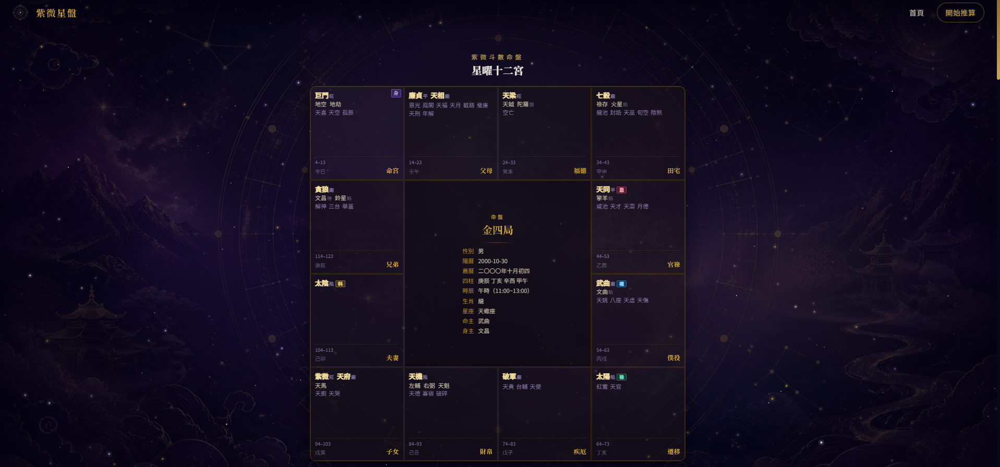
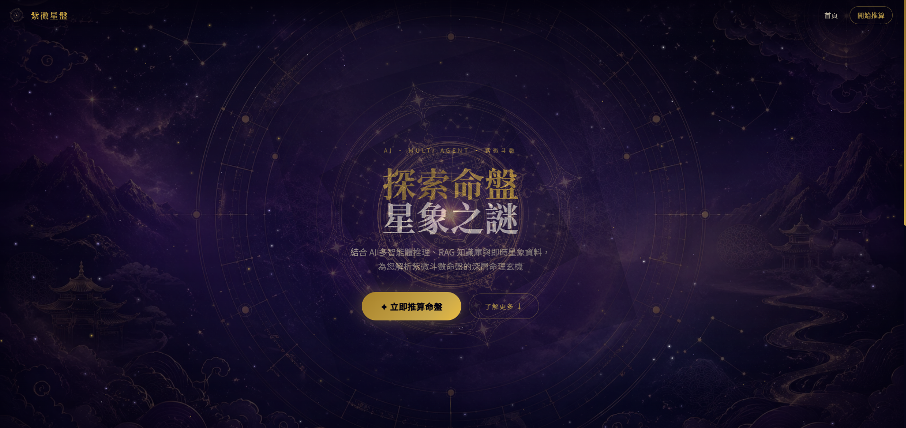
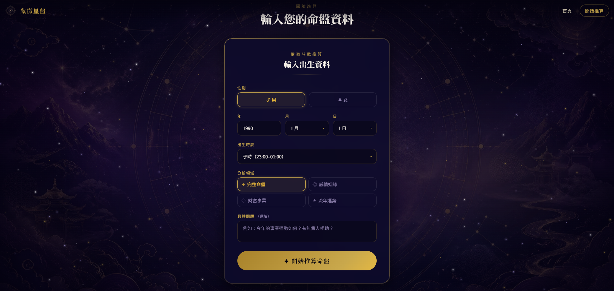
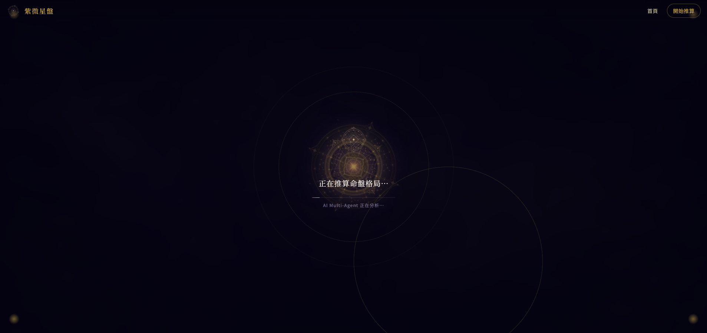
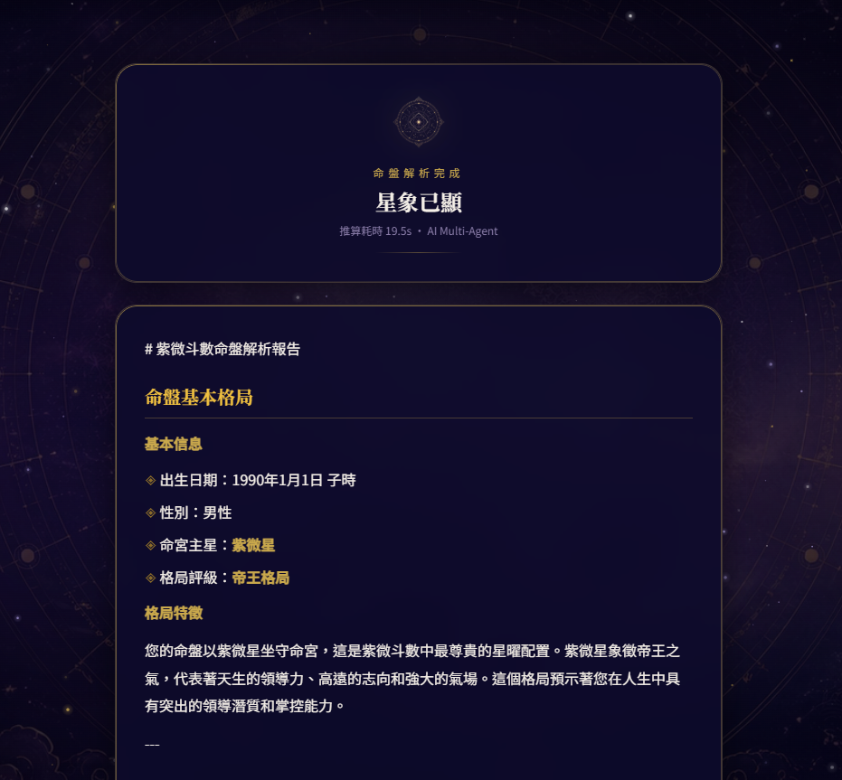
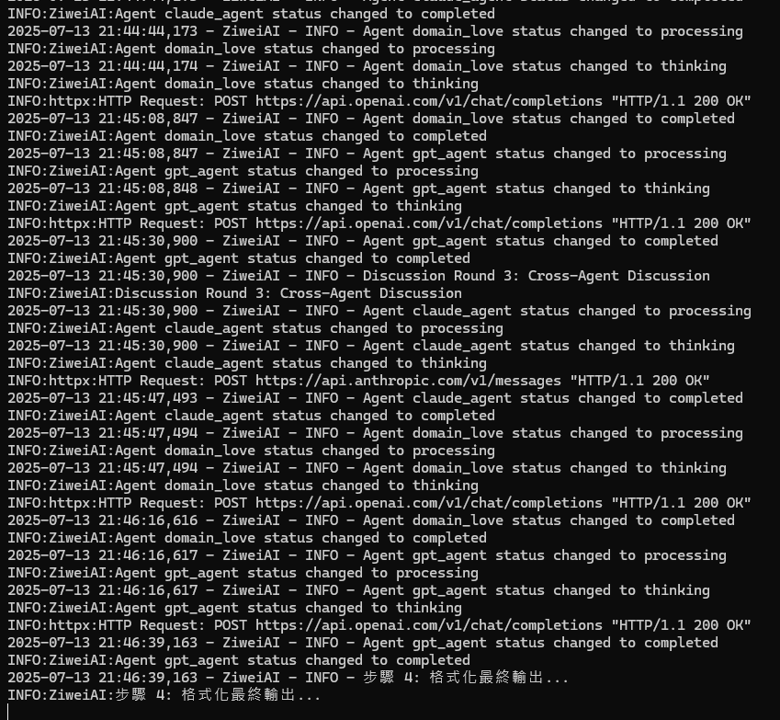
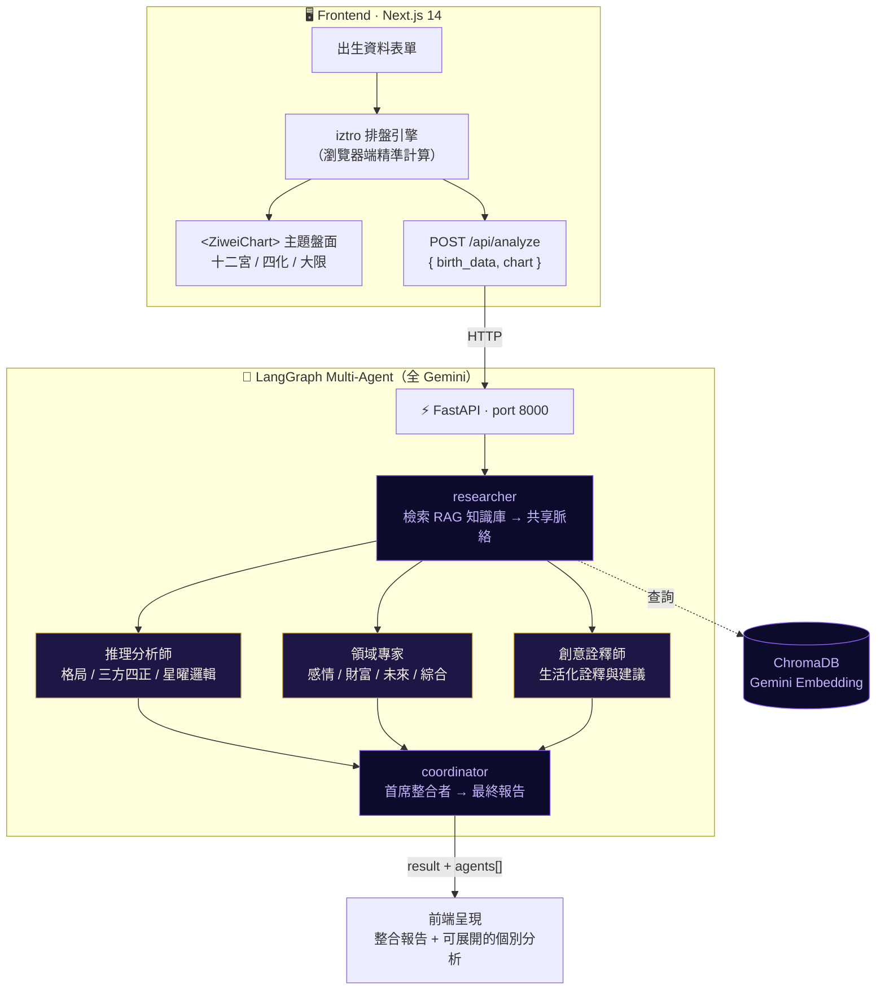

# 🔮 紫微斗數 Multi-Agent AI 系統

[](https://github.com/Tsai1030/Full-multi-agent)
[](https://opensource.org/licenses/MIT)
[](https://www.python.org/downloads/)
[](https://nextjs.org/)
[](https://fastapi.tiangolo.com/)
[](https://langchain-ai.github.io/langgraph/)
[](https://ai.google.dev/)
[](https://github.com/SylarLong/iztro)
[](https://www.postgresql.org/)

> 一套以 **真實命盤** 為基礎、**帳號制**的紫微斗數 AI 命理應用。
> 命盤由官方 **iztro 排盤引擎** 精準計算（不由 LLM 編造），交給 **LangGraph multi-agent** 結合 **RAG 知識庫** 深度解盤；
> 使用者可建立帳號、**儲存多張命盤**、與**算命大師即時對談（逐字串流）**，並透過側邊欄使用多種算命功能。
> LLM 與 Embedding 僅需一把 **Google Gemini** 金鑰。

---

## 📸 系統展示

### 🧮 真實命盤盤面（本版新功能）

由官方 iztro 引擎精準排盤，自訂主題十二宮格完整呈現主輔星、四化、大限。

<p align="center">
  
</p>

### 操作流程

| 1️⃣ 首頁 | 2️⃣ 輸入出生資料 |
|:---:|:---:|
|  |  |

| 3️⃣ 命盤推算中 | 4️⃣ AI 深度解析結果 |
|:---:|:---:|
|  |  |

### ⚙️ Multi-Agent 後端運作

LangGraph multi-agent 依序排盤注入、查詢知識庫、彙整解盤的後端流程。

<p align="center">
  
</p>

---

## ✨ 核心特色

### 🧮 真實命盤，絕不編造
- 命盤由 [**iztro**](https://github.com/SylarLong/iztro) 官方排盤引擎在**前端**直接計算，結果與 iztro 完全一致。
- 完整呈現十二宮：主星（含廟旺亮度）、輔星、雜曜、**生年四化（祿權科忌）**、大限、命主／身主、五行局、身宮。
- LLM 只負責「解讀」命盤，**不負責排盤**，從根本杜絕星曜幻覺。

### 🎨 自訂主題命盤盤面
- 傳統 **4×4 十二宮格** 盤面，中央顯示基本命格資訊。
- 沿用金色／星空神秘主題，四化以彩色標籤標示，響應式設計。

### 🤖 真正的 LangGraph Multi-Agent
- **三位獨立 persona 的 Gemini agent 並行分析**同一命盤：推理分析師、領域專家、創意詮釋師。
- 先由 **researcher** 檢索知識庫產出共享脈絡，最後由 **coordinator（首席整合者）** 彙整三方觀點。
- 並行 fan-out / fan-in，名實相符的多代理人協作（非單模型扮多角）。
- 前端可展開「多代理人分析過程」，看見每位 agent 的個別分析。

### 📚 RAG 專業知識庫
- **ChromaDB** 持久化向量庫，啟動時自動索引（idempotent）。
- 嵌入模型使用 **Gemini Embedding**，紫微斗數知識庫（JSON chunks）。

### 🌐 Web Search
- 主要使用 **Tavily**，未設金鑰時自動 fallback 至 **DuckDuckGo**。

### 👤 帳號系統與命盤典藏（v3.0）
- **註冊即建命盤**：註冊時填入生辰，前端 iztro 排盤後自動建立帳號主人的主命盤。
- **Google 登入**：Google Identity Services（id_token）一鍵登入；新用戶自動導去補生辰頁。
- JWT 認證（access token + httpOnly refresh cookie）、bcrypt 密碼雜湊、**PostgreSQL + SQLAlchemy ORM**。
- 一個帳號可**儲存多張命盤**（自己／家人／朋友），隨時檢視完整盤面。

### 💬 與大師對談（逐字串流）
- 算命大師 persona「玄機子」依**選定的命盤**回答；對談紀錄存資料庫、可回顧。
- **SSE 逐字串流**（Gemini `astream`），滿版聊天介面，可隨時切換命盤。

### 🧭 Sidebar 應用 + 算命功能
- 可收合側邊欄（桌機）／手機抽屜，功能：**排盤分析 · 我的命盤 · 與大師對談 · 事業工作算命 · 感情姻緣算命**。
- 算命功能：選一張已存命盤 → 跑完整 multi-agent 報告。

### 🟣 單一金鑰即可運行
- LLM（`gemini-3.5-flash`）與 Embedding（`gemini-embedding-2`）皆使用 **Google Gemini**，只需一把金鑰。

---

## 🏗️ 系統架構

整體資料流：前端用 iztro 精準排盤 → 畫盤 + 把命盤 JSON 送後端 → LangGraph 多代理人解盤。


```mermaid
flowchart TD
    subgraph FE["🖥️ Frontend · Next.js 14"]
        Form["出生資料表單"] --> Iztro["iztro 排盤引擎<br/>（瀏覽器端精準計算）"]
        Iztro --> Board["&lt;ZiweiChart&gt; 主題盤面<br/>十二宮 / 四化 / 大限"]
        Iztro --> Post["POST /api/analyze<br/>{ birth_data, chart }"]
    end

    Post -->|HTTP| API["⚡ FastAPI · port 8000"]

    subgraph BE["🧠 LangGraph Multi-Agent（全 Gemini）"]
        API --> R["researcher<br/>檢索 RAG 知識庫 → 共享脈絡"]
        R --> A1["推理分析師<br/>格局 / 三方四正 / 星曜邏輯"]
        R --> A2["領域專家<br/>感情 / 財富 / 未來 / 綜合"]
        R --> A3["創意詮釋師<br/>生活化詮釋與建議"]
        A1 --> C["coordinator<br/>首席整合者 → 最終報告"]
        A2 --> C
        A3 --> C
    end

    C -->|"result + agents[]"| Result["前端呈現<br/>整合報告 + 可展開的個別分析"]

    R -.查詢.-> RAG[("ChromaDB<br/>Gemini Embedding")]

    classDef agent fill:#1E1645,stroke:#C9A84C,color:#F5F0E8;
    classDef infra fill:#0D0B2B,stroke:#8B5CF6,color:#C4B5FD;
    class A1,A2,A3 agent;
    class R,C,RAG infra;
```

**multi-agent 流程（並行 fan-out / fan-in）**：

```
START → researcher → ┌ 推理分析師 ┐
                     ├ 領域專家   ┤（三者並行）→ coordinator → END
                     └ 創意詮釋師 ┘
```

> **設計重點**
> 1. 命盤計算在前端用 iztro 完成（單一可信來源），同一份命盤 JSON 同時用於「畫盤」與「送後端解盤」，後端不再爬取外部網站。
> 2. 三位 agent 是**各自獨立 persona 的 Gemini 呼叫**、並行執行，再由 coordinator 整合 —— 名實相符的多代理人協作。
> 3. 全程可用 **LangSmith** 觀察 graph 每一步（見下方〈觀察 Multi-Agent 流程〉）。

### 應用架構（v3.0 帳號制）

```
登入 / Google OAuth ─┐
                     ▼
       ┌──────────────────────────── Sidebar 應用框架 ────────────────────────────┐
       │  排盤分析   我的命盤   與大師對談        事業工作算命 / 感情姻緣算命       │
       │  (iztro)   (Profile)  (SSE 串流對談)    (選命盤 → multi-agent 報告)        │
       └───────────────┬───────────────┬───────────────────┬───────────────────────┘
                       ▼               ▼                   ▼
   FastAPI  /api/auth · /api/profiles · /api/chat(stream) · /api/analyze
                       │               │                   │
                       ▼               ▼                   ▼
          PostgreSQL（SQLAlchemy ORM）          LangGraph multi-agent（Gemini）
          users · chart_profiles ·              + RAG（ChromaDB · Gemini Embedding）
          chat_sessions · chat_messages
```

- **認證**：access token（JSON, 15 分）+ refresh token（httpOnly cookie, 7 天）；密碼用 bcrypt。
- **資料模型**：`User 1—N ChartProfile 1—N ChatSession 1—N ChatMessage`（UUID 主鍵、FK cascade）。
- **對談串流**：`/api/chat/.../messages/stream` 回 `text/event-stream`，前端用 fetch + ReadableStream 逐字渲染。

---

## 🚀 快速開始

### 環境需求

| 工具 | 版本 | 說明 |
|------|------|------|
| Python | 3.10+ | 後端 |
| [uv](https://docs.astral.sh/uv/) | 最新版 | Python 套件 / 環境管理 |
| Node.js | 18+ | 前端 |
| Yarn | 1.x | 前端套件管理 |
| Docker Desktop | — | 跑 PostgreSQL（`docker compose up -d`） |
| Google Gemini API Key | — | [免費取得](https://aistudio.google.com/apikey) |

### 1. 複製專案

```bash
git clone https://github.com/Tsai1030/Full-multi-agent.git
cd Full-multi-agent
```

### 2. 設定環境變數

複製範例檔並填入你的 Gemini 金鑰（`.env` 已被 git 忽略，不會上傳）：

```bash
cp .env.example .env
```

`.env` 至少需填：

```env
GOOGLE_API_KEY=你的_gemini_api_key
JWT_SECRET_KEY=隨機長字串   # python -c "import secrets;print(secrets.token_hex(32))"
```

`DATABASE_URL` 已預設指向下方 Docker 的 Postgres；Google 登入（選用）需 `GOOGLE_OAUTH_CLIENT_ID`。
其餘設定詳見 [`.env.example`](.env.example)。

### 3. 啟動資料庫（Docker）

```bash
docker compose up -d          # 於 repo 根目錄，啟動 PostgreSQL 16
```

### 4. 啟動後端（uv）

```bash
cd backend
uv sync                       # 建立 .venv 並安裝所有依賴
uv run alembic upgrade head   # 建立資料表（首次／更新 schema 時）
uv run python api_server.py   # 首次啟動會自動建立 RAG 向量庫
```

後端啟動於 `http://localhost:8000`。

### 5. 啟動前端（yarn）

另開一個終端：

```bash
cd frontend
yarn install
# 選用：Google 登入 → 複製 .env.local.example 為 .env.local 並填 NEXT_PUBLIC_GOOGLE_CLIENT_ID
yarn dev
```

前端啟動於 `http://localhost:3000`。

### 6. 開始使用

| 服務 | URL |
|------|-----|
| 前端 | http://localhost:3000 |
| 命盤分析（免登入） | http://localhost:3000/analyze |
| 登入 / 註冊 | http://localhost:3000/login |
| Swagger UI | http://localhost:8000/docs |
| 健康檢查 | http://localhost:8000/health |

---

## ⚠️ 啟動注意事項

實際跑起來最常卡關的幾個地方，先看過一遍可以省下不少除錯時間：

### 1. 首次啟動務必先跑 migration

Docker 起的 PostgreSQL 是全新空庫，**沒有任何資料表**。沒先跑 `alembic upgrade head` 就直接啟動後端，
一碰到登入 / 註冊就會報 `relation "users" does not exist`。

```bash
cd backend
uv run alembic upgrade head
```

### 2. Port 5432 衝突（本機已有原生 PostgreSQL）

如果本機已經在跑非 Docker 的 PostgreSQL（佔用 `5432`），`docker compose up -d` 仍會「成功」，但容器的
host port 會綁定失敗——`docker compose ps` 顯示 healthy，實際上 `localhost:5432` 連到的是原生那一個，
帳密完全對不上。判斷方式：`netstat -ano | findstr :5432` 看到非 Docker 程序也在監聽。

解法是把 Docker 容器改用其他 host port，兩邊互不干擾：

1. [`docker-compose.yml`](docker-compose.yml) 的 `ports` 改成 `"5433:5432"`（或其他未被佔用的埠）
2. `.env` 的 `DATABASE_URL` 同步改成 `localhost:5433`
3. `docker compose down && docker compose up -d` 重建容器

### 3. 自訂前後端 Port

預設前端 `3000` / 後端 `8000`。若要改成其他埠（例如前端 `3333`、後端 `8222`），**下列幾處要一起改，缺一個都會連不上**：

| 檔案 | 設定 | 改法 |
|------|------|------|
| `frontend/package.json` | `"dev": "next dev -p 3000"` | 改成 `next dev -p 3333` |
| `.env`（後端） | `APP_PORT=8000` | 改成 `8222` |
| `.env`（後端） | `APP_CORS_ORIGINS=http://localhost:3000` | 改成 `http://localhost:3333`（否則前端會被 CORS 擋下） |
| `frontend/.env.local` | `NEXT_PUBLIC_API_URL=http://localhost:8000` | 改成 `http://localhost:8222` |

改完兩邊都要重新啟動（`.env` 是啟動時讀取並快取，存檔不會讓正在跑的程序生效）。

### 4. Google 登入：三處設定必須一致

Google OAuth 出錯九成是這三個地方對不起來：

| 位置 | 設定 | 要求 |
|------|------|------|
| Google Cloud Console → Credentials → OAuth Client | Authorized JavaScript origins | 必須包含目前實際的前端來源，例如 `http://localhost:3333`（**改了前端 port 記得回來加**，否則出現 `origin_mismatch`） |
| `frontend/.env.local` | `NEXT_PUBLIC_GOOGLE_CLIENT_ID` | 你的 OAuth Client ID |
| `.env`（後端） | `GOOGLE_OAUTH_CLIENT_ID` | **必須跟前端同一組值**，否則後端驗證 token 的 audience 對不上，會回傳「Google 憑證無效」（`.env.example` 預設是佔位字串 `your_client_id...`，記得換成真的值） |

Google Cloud Console 改完設定後，通常需要等幾分鐘到數小時才會生效。

---

## 🔮 使用流程

1. 前往 `http://localhost:3000/analyze`
2. 填入出生資料：性別、西元年月日、時辰（地支）
3. 選擇分析領域：愛情 / 財富 / 未來 / 綜合
4. （選填）輸入具體問題
5. 送出後，前端用 **iztro 即時排盤** 並顯示**命盤盤面**
6. 命盤同步送至後端，**LangGraph multi-agent** 進行解盤
7. 查看「命盤盤面 + AI 深度解析報告」

### 分析領域

| 領域 | 說明 |
|------|------|
| 💕 愛情感情 | 桃花運、夫妻宮、感情運勢與正緣分析 |
| 💰 財富事業 | 財帛宮、官祿宮、求財方位與事業契機 |
| 🔮 未來運勢 | 大限流年、人生關鍵時機與趨勢 |
| 🌟 綜合分析 | 全方位十二宮整合解析 |

---

## 📁 專案結構

```
Full-multi-agent/
├── docker-compose.yml            # PostgreSQL 16（Docker）
├── .env.example                  # 環境變數範例（複製為 .env）
├── zi_wei_dou_shu_rag_chunks.json # RAG 知識庫資料（73 chunks）
│
├── backend/
│   ├── pyproject.toml · uv.lock  # uv 專案（Gemini + LangGraph + RAG + DB/Auth）
│   ├── alembic/ · alembic.ini    # 資料庫 migration
│   ├── api_server.py             # FastAPI 主程式，掛載各 router
│   └── src/
│       ├── config/settings.py    # Pydantic 設定（DB / JWT / OAuth / Gemini …）
│       ├── db/                   # SQLAlchemy ORM：base / session / models
│       ├── auth/                 # security（JWT/bcrypt）/ dependencies
│       ├── chat/master.py        # 算命大師對談（含 SSE 串流）
│       ├── ziwei/format.py       # 命盤 JSON → 中文摘要（餵給 agent）
│       ├── prompts/master_prompt.py # 算命大師 persona「玄機子」
│       ├── graph/                # researcher / 3 agent / coordinator（並行 graph）
│       ├── rag/                  # ChromaDB + Gemini Embedding + retriever
│       ├── utils/llm.py          # 共用 Gemini 呼叫 + thinking 轉純文字
│       └── api/
│           ├── models.py         # 所有 pydantic 請求/回應模型
│           ├── router.py         # /api/analyze · /api/status · /api/domains
│           ├── auth_router.py    # /api/auth（register/login/google/refresh…）
│           ├── profile_router.py # /api/profiles（命盤 CRUD）
│           └── chat_router.py    # /api/chat（session / 訊息 / 串流）
│
└── frontend/
    └── src/
        ├── app/
        │   ├── page.tsx · analyze · login · onboarding   # 公開頁（頂部 Navbar）
        │   └── (app)/            # 登入後應用框架（sidebar，URL 不變）
        │       ├── layout.tsx    # 登入 gate + Sidebar + 內容區
        │       ├── reading/      # 排盤分析（in-app）
        │       ├── profiles/ · profiles/[id]/   # 我的命盤 / 完整盤面
        │       ├── master/ · master/[profileId]/ # 選命盤 / 滿版串流對談
        │       └── career/ · love/              # 事業 / 感情算命功能
        ├── components/
        │   ├── app/Sidebar.tsx   # 可收合側邊欄（手機抽屜）
        │   ├── ZiweiChart.tsx · ChartAnalyzer.tsx · FortuneFeature.tsx
        │   ├── GoogleSignInButton.tsx · BirthFields.tsx · ResultDisplay.tsx
        │   └── ...
        ├── contexts/AuthContext.tsx  # access token（記憶體）+ 掛載 refresh
        ├── lib/
        │   ├── ziwei.ts          # iztro 排盤封裝（computeChart）
        │   ├── api.ts            # 認證 fetch（401 自動 refresh）+ SSE 串流
        │   └── markdown.ts       # 輕量 Markdown → HTML
        └── types/index.ts
```

---

## 🔧 API 端點

### `POST /api/analyze`

```json
{
  "birth_data": {
    "gender": "男",
    "birth_year": 1990,
    "birth_month": 5,
    "birth_day": 20,
    "birth_hour": "午"
  },
  "domain_type": "comprehensive",
  "user_question": "今年事業運如何？",
  "chart": { "...": "前端 iztro 計算好的命盤 JSON（十二宮 / 星曜 / 四化）" }
}
```

> `chart` 由前端排盤後附上；後端據此解盤，不會自行排盤。

回應：

```json
{
  "success": true,
  "result": "## 命盤基本格局\n...（coordinator 整合後的報告）",
  "agents": [
    { "role": "reasoning", "label": "推理分析師", "content": "..." },
    { "role": "domain",    "label": "領域專家",   "content": "..." },
    { "role": "creative",  "label": "創意詮釋師", "content": "..." }
  ],
  "metadata": { "domain_type": "comprehensive", "agents_used": 3, "elapsed_ms": 51900 }
}
```

> `agents` 為三位 agent 的個別分析，供前端「多代理人分析過程」展示；`result` 為整合後最終報告。

| 端點 | 說明 |
|------|------|
| `POST /api/analyze` | 命盤解析（multi-agent，主要端點） |
| `POST /api/auth/register \| login \| google \| refresh \| logout` · `GET /api/auth/me` | 認證 |
| `GET\|POST /api/profiles` · `GET\|DELETE /api/profiles/{id}` | 命盤 Profile（需登入） |
| `POST /api/chat/sessions` · `GET /api/chat/sessions` | 對談 session |
| `GET /api/chat/sessions/{id}/messages` · `POST .../messages` · `POST .../messages/stream` | 對談訊息 / **SSE 串流** |
| `GET /api/status` · `GET /api/domains` · `GET /health` | 系統狀態 / 領域 / 健康檢查 |

---

## ⚙️ 設定說明

所有設定皆可於 `.env` 覆寫（鍵名見 [`.env.example`](.env.example)）。

| 變數 | 預設 | 說明 |
|------|------|------|
| `GOOGLE_API_KEY` | — | **必填**，Gemini 金鑰 |
| `DATABASE_URL` | `postgresql+asyncpg://ziwei:…@localhost:5432/ziwei` | PostgreSQL 連線 |
| `JWT_SECRET_KEY` | — | **必填**，JWT 簽章密鑰（上線請用隨機長字串） |
| `GOOGLE_OAUTH_CLIENT_ID` | 空 | Google 登入用；前端另設 `NEXT_PUBLIC_GOOGLE_CLIENT_ID` |
| `GEMINI_MODEL` | `gemini-3.5-flash` | multi-agent / 對談的 LLM |
| `GEMINI_EMBEDDING_MODEL` | `gemini-embedding-2` | RAG 嵌入模型 |
| `EMBEDDING_PROVIDER` | `gemini` | `gemini` 或 `openai` |
| `TAVILY_API_KEY` | 空 | 留空則用 DuckDuckGo |
| `LANGCHAIN_TRACING_V2` | `false` | 設 `true` + 金鑰即啟用 LangSmith 追蹤 |
| `APP_CORS_ORIGINS` | `http://localhost:3000` | 前端來源白名單（cookie 認證不可用 `*`） |

> **時辰對應**：地支 `子→0 … 亥→11`（`子時` 取 `00:00–01:00` 早子，與一般 iztro 應用一致）。

---

## 🧩 技術細節

- **命盤一致性**：前端 [`lib/ziwei.ts`](frontend/src/lib/ziwei.ts) 呼叫 `astro.bySolar(date, timeIndex, gender, true, 'zh-TW')`，序列化後同時供 [`ZiweiChart.tsx`](frontend/src/components/ZiweiChart.tsx) 畫盤與後端解盤。
- **多代理人並行**：[`graph/builder.py`](backend/src/graph/builder.py) 用 fan-out/fan-in 讓三個 agent 並行；state 的 `agent_outputs` 以 `operator.add` reducer 合併並行寫入（[`graph/state.py`](backend/src/graph/state.py)）。
- **後端格式化**：[`ziwei/format.py`](backend/src/ziwei/format.py) 把命盤 JSON 轉成中文摘要，注入各 agent prompt，明確要求「以此命盤為唯一依據」。
- **Gemini 相容處理**：`gemini-3.5-flash` 回覆為 thinking 分段，已用 `_content_to_text` 轉純文字。
- **設定載入**：`settings.py` 以絕對路徑讀取 **repo 根目錄** 的 `.env`；`api_server.py` 另用 `load_dotenv` 將 `.env` 載入 `os.environ`（供 LangSmith 等讀取）。

---

## 🔍 觀察 Multi-Agent 流程（LangSmith）

可用 [LangSmith](https://smith.langchain.com) 完整觀察 graph 每一步、每次 Gemini 呼叫的 input/output、耗時與 token。

1. 到 https://smith.langchain.com 註冊並取得 API key（免費）
2. 在 `.env` 設定：
   ```env
   LANGCHAIN_TRACING_V2=true
   LANGCHAIN_API_KEY=lsv2_...
   LANGCHAIN_PROJECT=ziwei-multi-agent
   ```
3. 重啟後端並跑一次分析 → 到 LangSmith 專案 `ziwei-multi-agent` 查看 trace

trace 會呈現完整流程樹，三個 agent 在時間軸上**重疊**，直接驗證並行：

```
researcher
 ├─ reasoning_agent  ┐
 ├─ domain_agent     ┤  （並行，時間軸重疊）
 └─ creative_agent   ┘
coordinator
```

---

## 🐛 常見問題

| 問題 | 解決方式 |
|------|---------|
| `RAG init failed: API key required` | `.env` 未填 `GOOGLE_API_KEY`，或 `.env` 不在 repo 根目錄 |
| 命盤日期錯誤 / 排盤失敗 | 確認出生年月日為有效國曆日期 |
| 前端連不到後端 | 確認後端已啟動於 `:8000`，且 `APP_CORS_ORIGINS` 含前端位址 |
| 分析很慢 | 正常，multi-agent 會多輪查詢知識庫；可調低 `GRAPH_MAX_ITERATIONS` |
| 想換模型 | 改 `.env` 的 `GEMINI_MODEL` / `GEMINI_EMBEDDING_MODEL` 即可 |

---

## 📦 技術棧

**Backend** — FastAPI · LangGraph · langchain-google-genai（Gemini）· ChromaDB · **PostgreSQL · SQLAlchemy 2.0 · Alembic · PyJWT · bcrypt** · Tavily · Loguru · uv

**Frontend** — Next.js 14（App Router）· TypeScript · Tailwind CSS · Framer Motion · **iztro** · Google Identity Services · Yarn

**Infra** — Docker（PostgreSQL）· LangSmith（追蹤）

---

## 📝 版本記錄

### v3.0.0（2026-06-07）— 當前版本
- **帳號系統**：註冊即建主命盤、Google OAuth 登入 + 補生辰、JWT（access + httpOnly refresh）、PostgreSQL + SQLAlchemy ORM。
- **與大師對談**：SSE 逐字串流、滿版聊天、依選定命盤回答、對談紀錄存 DB。
- **Sidebar 應用框架**：可收合側欄；排盤分析 / 我的命盤 / 對談 / 事業工作算命 / 感情姻緣算命。
- **算命功能**：事業工作、感情姻緣 —— 選已存命盤跑完整 multi-agent 報告。
- **其他**：命盤完整盤面檢視、儲存多張命盤、Markdown 正確渲染、修正串流抖動、全面 RWD。

### v2.2.0（2026-06-07）
- **升級為真正的 Multi-Agent**：graph 改為 `researcher → 推理／領域／創意（並行）→ coordinator`，三位獨立 persona 的 Gemini agent 協作（取代原本單模型扮多角的 ReAct loop）。
- **看得見的多代理人**：API 回傳新增 `agents` 欄位，前端新增可展開的「多代理人分析過程」。
- **LangSmith 追蹤**：`api_server.py` 載入 `.env` 至 `os.environ`，設定 `LANGCHAIN_TRACING_V2=true` 即可在 LangSmith 觀察 graph。

### v2.1.0（2026-06-06）
- **新增命盤功能**：以官方 **iztro** 引擎在前端精準排盤，新增自訂主題 **十二宮命盤盤面**。
- **全面改用 Google Gemini**：LLM 換成 `gemini-3.5-flash`、Embedding 換成 `gemini-embedding-2`，全系統只需一把金鑰。
- **命盤驅動解盤**：前端排好的命盤 JSON 一併送後端，agent 以真實命盤解讀，後端不再爬取外部網站。
- **uv 化後端**：新增 `pyproject.toml` / `uv.lock`，以 `uv sync` / `uv run` 管理。
- **設定修正**：`.env` 改由 repo 根目錄絕對路徑載入，修正從 `backend/` 啟動時金鑰讀不到的問題。

### v2.0.0（2026-04-29）
- 架構全面重寫：LangGraph StateGraph、自訂 Python MCP Server、Next.js 14 前端。

### v1.x（2025-07）
- 初始版本：Multi-Agent coordinator + Node.js MCP + React CRA。

---

## 👥 Contributors

- [**Tsai1030**](https://github.com/Tsai1030) — 作者 / 維護者
- **codex** — 開發協作

---

## 📄 授權

本專案採用 [MIT License](LICENSE)。

---

<div align="center">

**🔮 以 AI 之眼，洞見命理之道 🔮**

*Built by [Tsai1030](https://github.com/Tsai1030) · codex*

</div>
