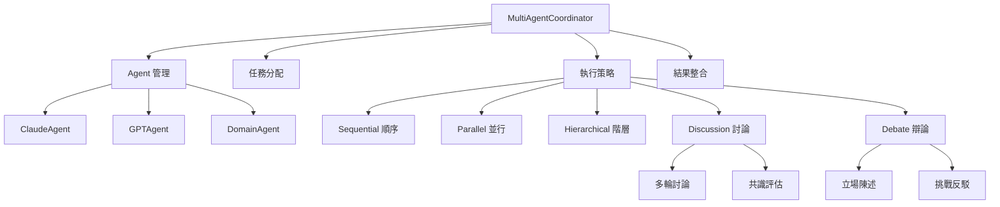

# MultiAgentCoordinator 多智能體協調器逐行程式碼解析

## 📋 檔案概述

**檔案路徑**: `src/agents/coordinator.py`  
**檔案作用**: 實現多智能體系統的核心協調器，管理 Agent 間的協作、討論和辯論  
**設計模式**: 協調器模式 + 策略模式 + 觀察者模式 + 工廠模式  
**核心概念**: Multi-Agent 系統的大腦，負責任務分配、執行策略、結果整合和協作管理

## 🏗️ 整體架構



## 📝 逐行程式碼解析

### 🔧 導入與基礎設定 (第1-19行)

```python
"""
Multi-Agent 協調器
負責協調多個Agent的工作，整合分析結果
"""

import asyncio
import time
import logging
from typing import Dict, Any, List, Optional, Tuple
from dataclasses import dataclass
from enum import Enum

from .base_agent import BaseAgent, AgentTask, AgentResponse, AgentRole
from .claude_agent import ClaudeAgent
from .gpt_agent import GPTAgent
from .domain_agent import DomainAgent
from ..config.settings import get_settings

settings = get_settings()
```

**架構設計**:
- **核心定位**: 明確定義為多智能體系統的協調中心
- **異步支援**: 導入 `asyncio` 支援大規模並行協調
- **性能監控**: 導入 `time` 用於協調過程的時間追蹤
- **類型安全**: 完整的類型提示支援複雜的協調邏輯
- **Agent 整合**: 導入所有需要協調的 Agent 類型
- **配置管理**: 使用統一的設定管理系統

### 🎯 協調策略枚舉 (第21-27行)

```python
class CoordinationStrategy(Enum):
    """協調策略"""
    SEQUENTIAL = "sequential"  # 順序執行
    PARALLEL = "parallel"     # 並行執行
    HIERARCHICAL = "hierarchical"  # 階層式執行
    DISCUSSION = "discussion"  # 討論式協作
    DEBATE = "debate"         # 辯論式協作
```

**架構設計**:
- **策略模式**: 定義五種不同的協調執行策略
- **靈活性**: 可根據任務特性選擇最適合的協調方式
- **擴展性**: 易於添加新的協調策略

**策略說明**:
1. `SEQUENTIAL`: 按順序逐一執行，適合有依賴關係的任務
2. `PARALLEL`: 並行執行，適合獨立任務的快速處理
3. `HIERARCHICAL`: 階層式執行，適合有優先級的複雜任務
4. `DISCUSSION`: 討論式協作，適合需要共識的分析任務
5. `DEBATE`: 辯論式協作，適合需要深度探討的複雜問題

### 📊 數據結構定義 (第29-62行)

```python
@dataclass
class AgentAssignment:
    """Agent任務分配"""
    agent: BaseAgent
    task: AgentTask
    priority: int = 1
    timeout: int = 60

@dataclass
class DiscussionRound:
    """討論輪次"""
    round_number: int
    topic: str
    participants: List[str]  # Agent IDs
    responses: List[AgentResponse]
    consensus_level: float = 0.0  # 共識程度 0-1

@dataclass
class DiscussionResult:
    """討論結果"""
    rounds: List[DiscussionRound]
    final_consensus: str
    key_insights: List[str]
    disagreements: List[str]

@dataclass
class CoordinationResult:
    """協調結果"""
    success: bool
    responses: List[AgentResponse]
    integrated_result: Optional[str] = None
    metadata: Optional[Dict[str, Any]] = None
    total_time: Optional[float] = None
    discussion_result: Optional[DiscussionResult] = None
```

**架構設計**:
- **數據封裝**: 使用 `@dataclass` 封裝複雜的協調數據
- **層次結構**: 從任務分配到最終結果的完整數據流
- **可追蹤性**: 記錄協調過程的所有關鍵信息
- **結果整合**: 統一的結果格式便於後續處理

**數據流向**:
```
AgentAssignment → DiscussionRound → DiscussionResult → CoordinationResult
```

### 🤖 協調器主類初始化 (第64-83行)

```python
class MultiAgentCoordinator:
    """Multi-Agent 協調器"""
    
    def __init__(self, logger=None):
        self.logger = logger or logging.getLogger(__name__)
        
        # 初始化Agents
        self.agents = {}
        self._initialize_agents()
        
        # 協調設定
        self.max_iterations = settings.multi_agent.coordinator_max_iterations
        self.timeout = settings.multi_agent.coordinator_timeout
        self.default_strategy = CoordinationStrategy.DISCUSSION

        # 討論設定 # 如果執行太久可以從這裡做調整
        self.max_discussion_rounds = 3
        self.consensus_threshold = 0.7
        self.discussion_timeout = 120
```

**架構設計**:
- **中央管理**: 作為所有 Agent 的中央管理器
- **配置驅動**: 通過配置文件控制協調行為
- **可調參數**: 討論輪數、共識閾值、超時時間等可調整
- **默認策略**: 設定討論式協作為默認策略

**關鍵參數**:
- `max_discussion_rounds`: 3 (最大討論輪數)
- `consensus_threshold`: 0.7 (共識達成閾值)
- `discussion_timeout`: 120 秒 (討論超時時間)

### 🏭 Agent 初始化工廠 (第84-111行)

```python
def _initialize_agents(self):
    """初始化所有Agent"""
    try:
        # Claude Agent
        if settings.multi_agent.claude_agent_enabled:
            self.agents['claude'] = ClaudeAgent(logger=self.logger)
            self.logger.info("Claude Agent initialized")
        
        # GPT Agent
        if settings.multi_agent.gpt_agent_enabled:
            self.agents['gpt'] = GPTAgent(logger=self.logger)
            self.logger.info("GPT Agent initialized")
        
        # Domain Agents
        if settings.multi_agent.domain_agent_enabled:
            domain_types = ['love', 'wealth', 'future']
            for domain in domain_types:
                agent_id = f"domain_{domain}"
                self.agents[agent_id] = DomainAgent(
                    agent_id=agent_id,
                    domain_type=domain,
                    logger=self.logger
                )
                self.logger.info(f"Domain Agent ({domain}) initialized")
                
    except Exception as e:
        self.logger.error(f"Agent initialization failed: {str(e)}")
        raise
```

**架構設計**:
- **工廠模式**: 統一創建和管理所有 Agent 實例
- **配置控制**: 通過配置文件控制 Agent 的啟用狀態
- **錯誤處理**: 完整的初始化錯誤處理機制
- **日誌追蹤**: 詳細記錄每個 Agent 的初始化狀態

**Agent 配置**:
- **Claude Agent**: 邏輯推理專家
- **GPT Agent**: 創意解釋專家
- **Domain Agents**: 三個領域專家（愛情、財富、未來）

## 🎯 核心協調方法

### 主協調方法 (第113-171行)

```python
async def coordinate_analysis(self, 
                            input_data: Dict[str, Any],
                            domain_type: str = "general",
                            strategy: CoordinationStrategy = None) -> CoordinationResult:
    """協調多Agent分析"""
    
    start_time = time.time()
    strategy = strategy or self.default_strategy
    
    try:
        self.logger.info(f"Starting multi-agent coordination for {domain_type}")
        
        # 1. 準備任務
        tasks = await self._prepare_tasks(input_data, domain_type)
        
        # 2. 分配Agent
        assignments = await self._assign_agents(tasks, domain_type)
        
        # 3. 執行協調策略
        if strategy == CoordinationStrategy.SEQUENTIAL:
            responses = await self._execute_sequential(assignments)
        elif strategy == CoordinationStrategy.PARALLEL:
            responses = await self._execute_parallel(assignments)
        elif strategy == CoordinationStrategy.DISCUSSION:
            responses, discussion_result = await self._execute_discussion(assignments, input_data, domain_type)
        elif strategy == CoordinationStrategy.DEBATE:
            responses, discussion_result = await self._execute_debate(assignments, input_data, domain_type)
        else:  # HIERARCHICAL
            responses = await self._execute_hierarchical(assignments)
            discussion_result = None
        
        # 4. 整合結果
        integrated_result = await self._integrate_responses(responses, domain_type)
        
        total_time = time.time() - start_time
        
        return CoordinationResult(
            success=True,
            responses=responses,
            integrated_result=integrated_result,
            metadata={
                "strategy": strategy.value,
                "domain_type": domain_type,
                "agents_used": [r.agent_id for r in responses],
                "total_agents": len(assignments),
                "discussion_rounds": getattr(discussion_result, 'rounds', []) if 'discussion_result' in locals() else []
            },
            total_time=total_time,
            discussion_result=discussion_result if 'discussion_result' in locals() else None
        )
        
    except Exception as e:
        self.logger.error(f"Coordination failed: {str(e)}")
        return CoordinationResult(
            success=False,
            responses=[],
            metadata={"error": str(e)},
            total_time=time.time() - start_time
        )
```

**架構設計**:
- **四步協調流程**: 準備任務 → 分配 Agent → 執行策略 → 整合結果
- **策略路由**: 根據策略類型路由到對應的執行方法
- **完整監控**: 記錄執行時間、使用的 Agent、討論輪數等
- **錯誤恢復**: 異常情況下返回失敗結果而非崩潰

**協調流程**:
1. **任務準備**: 根據輸入數據和領域類型準備具體任務
2. **Agent 分配**: 將任務分配給最適合的 Agent
3. **策略執行**: 根據選定策略執行協調邏輯
4. **結果整合**: 將多個 Agent 的結果整合為統一輸出

### 任務準備方法 (第173-221行)

```python
async def _prepare_tasks(self, input_data: Dict[str, Any], domain_type: str) -> List[AgentTask]:
    """準備Agent任務"""

    tasks = []

    # Claude Agent 任務 - 邏輯分析
    if 'claude' in self.agents:
        claude_task = AgentTask(
            task_id="claude_analysis",
            task_type="ziwei_analysis",
            input_data={
                "chart_data": input_data.get('chart_data', {}),
                "domain_type": domain_type
            },
            context={"analysis_type": "logical_reasoning"}
        )
        tasks.append(claude_task)

    # GPT Agent 任務 - 創意解釋
    if 'gpt' in self.agents:
        gpt_task = AgentTask(
            task_id="gpt_interpretation",
            task_type="creative_interpretation",
            input_data={
                "analysis_data": input_data.get('chart_data', {}),
                "domain_type": domain_type,
                "user_profile": input_data.get('user_profile', {})
            },
            context={"interpretation_style": "creative"}
        )
        tasks.append(gpt_task)

    # Domain Agent 任務 - 專業分析
    domain_agent_id = f"domain_{domain_type}"
    if domain_agent_id in self.agents:
        domain_task = AgentTask(
            task_id=f"domain_{domain_type}_analysis",
            task_type="professional_analysis",
            input_data={
                "chart_data": input_data.get('chart_data', {}),
                "user_concerns": input_data.get('user_concerns', []),
                "career_stage": input_data.get('career_stage', ''),
                "time_range": input_data.get('time_range', '未來5年')
            },
            context={"domain_type": domain_type}
        )
        tasks.append(domain_task)

    return tasks
```

**架構設計**:
- **任務工廠**: 根據可用 Agent 動態創建對應任務
- **角色分工**: 每個 Agent 有明確的任務類型和職責
- **數據適配**: 將輸入數據適配為各 Agent 需要的格式
- **上下文傳遞**: 為每個任務提供特定的執行上下文

**任務分配邏輯**:
1. **Claude**: 邏輯分析任務，專注於理性推理
2. **GPT**: 創意解釋任務，專注於人性化表達
3. **Domain**: 專業分析任務，專注於領域專精

### Agent 分配方法 (第223-259行)

```python
async def _assign_agents(self, tasks: List[AgentTask], domain_type: str) -> List[AgentAssignment]:
    """分配Agent任務"""

    assignments = []

    for task in tasks:
        # 根據任務類型選擇合適的Agent
        if task.task_type == "ziwei_analysis" and 'claude' in self.agents:
            agent = self.agents['claude']
            priority = 1  # 邏輯分析優先級最高

        elif task.task_type == "creative_interpretation" and 'gpt' in self.agents:
            agent = self.agents['gpt']
            priority = 2  # 創意解釋次之

        elif task.task_type == "professional_analysis":
            domain_agent_id = f"domain_{domain_type}"
            if domain_agent_id in self.agents:
                agent = self.agents[domain_agent_id]
                priority = 1  # 專業分析也是高優先級
            else:
                continue  # 跳過沒有對應Agent的任務
        else:
            continue  # 跳過無法處理的任務

        assignment = AgentAssignment(
            agent=agent,
            task=task,
            priority=priority,
            timeout=self.timeout
        )
        assignments.append(assignment)

    # 按優先級排序
    assignments.sort(key=lambda x: x.priority)

    return assignments
```

**架構設計**:
- **智能匹配**: 根據任務類型智能匹配最適合的 Agent
- **優先級管理**: 設定任務優先級，確保重要任務優先執行
- **容錯處理**: 跳過無法處理的任務，不影響整體流程
- **排序優化**: 按優先級排序，優化執行順序

**優先級設計**:
- **優先級 1**: 邏輯分析、專業分析（核心任務）
- **優先級 2**: 創意解釋（輔助任務）

## 🔄 執行策略實現

### 順序執行策略 (第261-282行)

```python
async def _execute_sequential(self, assignments: List[AgentAssignment]) -> List[AgentResponse]:
    """順序執行策略"""

    responses = []

    for assignment in assignments:
        try:
            self.logger.info(f"Executing task {assignment.task.task_id} on {assignment.agent.agent_id}")

            response = await asyncio.wait_for(
                assignment.agent.process_task(assignment.task),
                timeout=assignment.timeout
            )

            responses.append(response)

        except asyncio.TimeoutError:
            self.logger.warning(f"Task {assignment.task.task_id} timed out")
        except Exception as e:
            self.logger.error(f"Task {assignment.task.task_id} failed: {str(e)}")

    return responses
```

**架構設計**:
- **順序保證**: 嚴格按順序執行，確保任務間的依賴關係
- **超時控制**: 每個任務都有獨立的超時控制
- **錯誤隔離**: 單個任務失敗不影響後續任務執行
- **詳細日誌**: 記錄每個任務的執行狀態

### 並行執行策略 (第284-306行)

```python
async def _execute_parallel(self, assignments: List[AgentAssignment]) -> List[AgentResponse]:
    """並行執行策略"""

    # 創建並行任務
    tasks = []
    for assignment in assignments:
        task = asyncio.create_task(
            self._execute_single_assignment(assignment)
        )
        tasks.append(task)

    # 等待所有任務完成
    results = await asyncio.gather(*tasks, return_exceptions=True)

    # 過濾成功的回應
    responses = []
    for result in results:
        if isinstance(result, AgentResponse):
            responses.append(result)
        elif isinstance(result, Exception):
            self.logger.error(f"Parallel task failed: {str(result)}")

    return responses
```

**架構設計**:
- **真並行**: 使用 `asyncio.create_task` 實現真正的並行執行
- **異常處理**: 使用 `return_exceptions=True` 避免單個失敗影響整體
- **結果過濾**: 自動過濾成功和失敗的結果
- **性能優化**: 最大化利用異步執行的性能優勢

### 階層執行策略 (第308-340行)

```python
async def _execute_hierarchical(self, assignments: List[AgentAssignment]) -> List[AgentResponse]:
    """階層式執行策略"""

    responses = []

    # 第一層：邏輯分析 (Claude)
    logical_assignments = [a for a in assignments if a.agent.role == AgentRole.REASONING_ANALYSIS]
    if logical_assignments:
        logical_responses = await self._execute_parallel(logical_assignments)
        responses.extend(logical_responses)

    # 第二層：專業分析 (Domain Agent)
    domain_assignments = [a for a in assignments if a.agent.role == AgentRole.PROFESSIONAL_EXPERTISE]
    if domain_assignments:
        # 將邏輯分析結果作為上下文
        for assignment in domain_assignments:
            if logical_responses:
                assignment.task.context['logical_analysis'] = logical_responses[0].content

        domain_responses = await self._execute_parallel(domain_assignments)
        responses.extend(domain_responses)

    # 第三層：創意解釋 (GPT)
    creative_assignments = [a for a in assignments if a.agent.role == AgentRole.CREATIVE_INTERPRETATION]
    if creative_assignments:
        # 將前面的分析結果作為上下文
        for assignment in creative_assignments:
            assignment.task.context['previous_analysis'] = [r.content for r in responses]

        creative_responses = await self._execute_parallel(creative_assignments)
        responses.extend(creative_responses)

    return responses
```

**架構設計**:
- **三層架構**: 邏輯分析 → 專業分析 → 創意解釋的層次化執行
- **上下文傳遞**: 上層結果作為下層的輸入上下文
- **角色分層**: 根據 Agent 角色自動分層
- **並行優化**: 同層內部使用並行執行提高效率

**執行層次**:
1. **第一層**: Claude Agent（邏輯推理基礎）
2. **第二層**: Domain Agent（專業分析，基於邏輯分析）
3. **第三層**: GPT Agent（創意解釋，基於前面所有分析）

## 💬 討論式協作實現

### 討論執行方法 (第425-494行)

```python
async def _execute_discussion(self, assignments: List[AgentAssignment],
                             input_data: Dict[str, Any],
                             domain_type: str) -> Tuple[List[AgentResponse], DiscussionResult]:
    """執行討論式協作"""

    self.logger.info("Starting discussion-based coordination")

    # 初始化討論
    discussion_rounds = []
    all_responses = []

    # 第一輪：初始分析
    self.logger.info("Discussion Round 1: Initial Analysis")
    initial_responses = await self._execute_parallel(assignments)
    all_responses.extend(initial_responses)

    round_1 = DiscussionRound(
        round_number=1,
        topic="初始分析",
        participants=[r.agent_id for r in initial_responses],
        responses=initial_responses,
        consensus_level=0.0
    )
    discussion_rounds.append(round_1)

    # 後續討論輪次
    for round_num in range(2, self.max_discussion_rounds + 1):
        self.logger.info(f"Discussion Round {round_num}: Cross-Agent Discussion")

        # 準備討論上下文
        discussion_context = self._build_discussion_context(discussion_rounds, domain_type)

        # 讓每個 Agent 對其他 Agent 的觀點進行回應
        round_responses = await self._conduct_discussion_round(
            assignments, discussion_context, round_num, domain_type
        )

        if round_responses:
            all_responses.extend(round_responses)

            # 評估共識程度
            consensus_level = await self._evaluate_consensus(round_responses)

            discussion_round = DiscussionRound(
                round_number=round_num,
                topic=f"交叉討論 - 輪次 {round_num}",
                participants=[r.agent_id for r in round_responses],
                responses=round_responses,
                consensus_level=consensus_level
            )
            discussion_rounds.append(discussion_round)

            # 如果達到共識閾值，提前結束
            if consensus_level >= self.consensus_threshold:
                self.logger.info(f"Consensus reached at round {round_num}")
                break

    # 生成最終共識和洞察
    final_consensus = await self._generate_final_consensus(discussion_rounds, domain_type)
    key_insights = await self._extract_key_insights(discussion_rounds)
    disagreements = await self._identify_disagreements(discussion_rounds)

    discussion_result = DiscussionResult(
        rounds=discussion_rounds,
        final_consensus=final_consensus,
        key_insights=key_insights,
        disagreements=disagreements
    )

    return all_responses, discussion_result
```

**架構設計**:
- **多輪討論**: 支援最多 3 輪的深度討論
- **共識評估**: 每輪都評估 Agent 間的共識程度
- **早期終止**: 達到共識閾值時提前結束，提高效率
- **結果整合**: 生成最終共識、關鍵洞察和分歧點

**討論流程**:
1. **第一輪**: 初始分析，各 Agent 獨立給出觀點
2. **後續輪次**: 交叉討論，Agent 互相回應和補充
3. **共識評估**: 評估觀點的一致性程度
4. **結果生成**: 整合討論過程，生成最終結論

## 🎯 共識評估與結果整合

### 共識評估算法 (第673-724行)

```python
async def _evaluate_consensus(self, responses: List[AgentResponse]) -> float:
    """評估討論共識程度"""

    if len(responses) < 2:
        return 1.0

    # 簡化的共識評估：基於關鍵詞重疊和情感一致性
    keywords_sets = []
    sentiments = []

    for response in responses:
        # 提取關鍵詞（簡化版）
        content = response.content.lower()
        keywords = set()

        # 紫微斗數相關關鍵詞
        ziwei_terms = ['紫微', '天機', '太陽', '武曲', '天同', '廉貞', '天府', '太陰', '貪狼', '巨門', '天相', '天梁', '七殺', '破軍']
        for term in ziwei_terms:
            if term in content:
                keywords.add(term)

        # 評價詞彙
        positive_terms = ['好', '佳', '優', '強', '旺', '吉', '利']
        negative_terms = ['差', '弱', '凶', '煞', '忌', '沖', '破']

        sentiment_score = 0
        for term in positive_terms:
            sentiment_score += content.count(term)
        for term in negative_terms:
            sentiment_score -= content.count(term)

        keywords_sets.append(keywords)
        sentiments.append(sentiment_score)

    # 計算關鍵詞重疊度
    if keywords_sets:
        intersection = set.intersection(*keywords_sets) if len(keywords_sets) > 1 else keywords_sets[0]
        union = set.union(*keywords_sets) if len(keywords_sets) > 1 else keywords_sets[0]
        keyword_overlap = len(intersection) / len(union) if union else 0
    else:
        keyword_overlap = 0

    # 計算情感一致性
    if sentiments:
        sentiment_variance = sum((s - sum(sentiments)/len(sentiments))**2 for s in sentiments) / len(sentiments)
        sentiment_consistency = max(0, 1 - sentiment_variance / 10)  # 正規化
    else:
        sentiment_consistency = 0

    # 綜合共識分數
    consensus_score = (keyword_overlap * 0.6 + sentiment_consistency * 0.4)
    return min(1.0, max(0.0, consensus_score))
```

**架構設計**:
- **多維評估**: 結合關鍵詞重疊和情感一致性
- **領域特化**: 針對紫微斗數術語進行特殊處理
- **數學模型**: 使用集合運算和統計方法計算共識度
- **正規化**: 確保結果在 0-1 範圍內

**評估算法**:
1. **關鍵詞分析**: 提取紫微斗數相關術語
2. **情感分析**: 計算正面/負面詞彙的情感傾向
3. **重疊度計算**: 使用集合交集/並集計算相似度
4. **綜合評分**: 關鍵詞重疊 60% + 情感一致性 40%

### 結果整合方法 (第362-399行)

```python
async def _integrate_responses(self, responses: List[AgentResponse], domain_type: str) -> str:
    """整合多Agent回應"""

    if not responses:
        return "無法獲得分析結果"

    # 按Agent角色分組
    logical_analysis = []
    creative_interpretation = []
    professional_expertise = []

    for response in responses:
        if response.role == AgentRole.REASONING_ANALYSIS:
            logical_analysis.append(response)
        elif response.role == AgentRole.CREATIVE_INTERPRETATION:
            creative_interpretation.append(response)
        elif response.role == AgentRole.PROFESSIONAL_EXPERTISE:
            professional_expertise.append(response)

    # 構建整合結果
    integrated_parts = []

    if logical_analysis:
        integrated_parts.append("## 邏輯分析")
        for response in logical_analysis:
            integrated_parts.append(response.content)

    if professional_expertise:
        integrated_parts.append(f"## {domain_type}專業分析")
        for response in professional_expertise:
            integrated_parts.append(response.content)

    if creative_interpretation:
        integrated_parts.append("## 創意解釋")
        for response in creative_interpretation:
            integrated_parts.append(response.content)

    return "\n\n".join(integrated_parts)
```

**架構設計**:
- **角色分組**: 按 Agent 角色對回應進行分類
- **結構化輸出**: 使用 Markdown 格式組織結果
- **邏輯順序**: 邏輯分析 → 專業分析 → 創意解釋的順序
- **容錯處理**: 處理空回應的情況

## 🔍 討論上下文構建

### 討論上下文生成 (第562-581行)

```python
def _build_discussion_context(self, rounds: List[DiscussionRound], domain_type: str) -> str:
    """構建討論上下文"""

    context_parts = [f"## 紫微斗數 {domain_type} 分析討論"]

    for round_info in rounds:
        context_parts.append(f"\n### 第 {round_info.round_number} 輪：{round_info.topic}")

        for response in round_info.responses:
            context_parts.append(f"\n**{response.agent_id} 的觀點：**")
            context_parts.append(response.content[:500] + "..." if len(response.content) > 500 else response.content)

    context_parts.append("\n### 討論指引")
    context_parts.append("請基於以上各方觀點，提出您的補充見解、質疑或支持論點。")
    context_parts.append("重點關注：")
    context_parts.append("1. 其他 Agent 可能遺漏的重要面向")
    context_parts.append("2. 不同觀點之間的矛盾或互補")
    context_parts.append("3. 更深層的命理洞察")

    return "\n".join(context_parts)
```

**架構設計**:
- **結構化上下文**: 清晰的討論歷史和指引
- **內容摘要**: 限制每個回應的長度避免上下文過長
- **指導性**: 提供明確的討論方向和重點
- **建設性**: 鼓勵補充、質疑和深化分析

### 辯論上下文生成 (第583-603行)

```python
def _build_debate_context(self, rounds: List[DiscussionRound], domain_type: str) -> str:
    """構建辯論上下文"""

    context_parts = [f"## 紫微斗數 {domain_type} 分析辯論"]

    for round_info in rounds:
        context_parts.append(f"\n### 第 {round_info.round_number} 輪：{round_info.topic}")

        for response in round_info.responses:
            context_parts.append(f"\n**{response.agent_id} 的立場：**")
            context_parts.append(response.content[:500] + "..." if len(response.content) > 500 else response.content)

    context_parts.append("\n### 辯論指引")
    context_parts.append("請針對其他 Agent 的觀點進行建設性的挑戰或反駁。")
    context_parts.append("重點要求：")
    context_parts.append("1. 指出其他觀點的潛在問題或不足")
    context_parts.append("2. 提供更有力的證據或論證")
    context_parts.append("3. 維護您認為正確的命理解釋")
    context_parts.append("4. 保持專業和尊重的態度")

    return "\n".join(context_parts)
```

**架構設計**:
- **對抗性上下文**: 鼓勵挑戰和反駁的辯論氛圍
- **專業要求**: 強調證據支持和專業標準
- **建設性**: 即使在辯論中也要保持建設性
- **尊重原則**: 維持專業和尊重的辯論風格

## 🎯 系統監控與管理

### 健康檢查方法 (第410-423行)

```python
async def health_check(self) -> Dict[str, bool]:
    """檢查所有Agent健康狀態"""

    health_status = {}

    for agent_id, agent in self.agents.items():
        try:
            is_healthy = await agent.health_check()
            health_status[agent_id] = is_healthy
        except Exception as e:
            self.logger.error(f"Health check failed for {agent_id}: {str(e)}")
            health_status[agent_id] = False

    return health_status
```

**架構設計**:
- **全面檢查**: 檢查所有 Agent 的健康狀態
- **異常處理**: 單個 Agent 檢查失敗不影響其他
- **狀態報告**: 返回每個 Agent 的健康狀態

### 資源清理方法 (第846-859行)

```python
async def cleanup(self):
    """清理協調器資源"""
    try:
        # 清理所有 Agent
        for agent_id, agent in self.agents.items():
            if hasattr(agent, 'cleanup'):
                await agent.cleanup()
                self.logger.info(f"Agent {agent_id} 清理完成")

        self.agents.clear()
        self.logger.info("MultiAgentCoordinator 資源清理完成")

    except Exception as e:
        self.logger.error(f"MultiAgentCoordinator 清理失敗: {str(e)}")
```

**架構設計**:
- **級聯清理**: 清理所有管理的 Agent 資源
- **安全清理**: 檢查 Agent 是否有清理方法
- **狀態重置**: 清空 Agent 字典
- **日誌記錄**: 記錄清理過程和結果

## 🎯 設計模式總結

### 使用的設計模式

1. **協調器模式**: `MultiAgentCoordinator` 作為中央協調器
2. **策略模式**: 五種不同的執行策略
3. **工廠模式**: Agent 初始化和任務創建
4. **觀察者模式**: 討論過程的狀態監控
5. **模板方法模式**: 標準化的協調流程

### 架構優勢

1. **中央協調**: 統一管理所有 Agent 的協作
2. **策略靈活**: 支援多種執行策略適應不同場景
3. **智能協作**: 討論和辯論式的深度協作
4. **結果整合**: 自動整合多 Agent 的分析結果
5. **監控完善**: 完整的健康檢查和資源管理

### 核心特色

- **Multi-Agent 協調**: 真正的多智能體協作系統
- **討論式協作**: 支援 Agent 間的深度討論和辯論
- **共識評估**: 智能評估 Agent 間的共識程度
- **結果整合**: 自動整合不同角色的分析結果
- **策略豐富**: 五種執行策略適應不同需求

### 使用場景

此協調器適用於：
- 需要多角度分析的複雜問題
- 要求深度討論的專業諮詢
- Multi-Agent 系統的核心協調
- 需要共識達成的團隊決策
- 大規模並行分析任務
