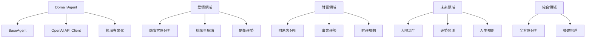

# DomainAgent 專業領域代理逐行程式碼解析

## 📋 檔案概述

**檔案路徑**: `src/agents/domain_agent.py`  
**檔案作用**: 實現基於特定領域專業知識的專家代理  
**設計模式**: 繼承模式 + 策略模式 + 工廠模式  
**核心概念**: 專精特定領域（愛情/財富/未來）的專業知識和實務經驗的 AI 代理

## 🏗️ 整體架構



## 📝 逐行程式碼解析

### 🔧 導入與基礎設定 (第1-14行)

```python
"""
專業領域Agent
專門負責特定領域的專業知識和實務經驗
"""

import asyncio
import time
from typing import Dict, Any, List, Optional
import openai
from .base_agent import BaseAgent, AgentRole, AgentStatus, AgentTask, AgentResponse, AgentMessage
from ..config.settings import get_settings

settings = get_settings()
```

**架構設計**:
- **專業定位**: 明確定義為特定領域的專業知識專家
- **異步支援**: 導入 `asyncio` 支援非阻塞操作
- **性能監控**: 導入 `time` 用於處理時間追蹤
- **API 整合**: 導入 `openai` 官方客戶端
- **繼承架構**: 從 `BaseAgent` 繼承基礎功能
- **配置管理**: 使用統一的設定管理系統

### 🎯 DomainAgent 類初始化 (第15-43行)

```python
class DomainAgent(BaseAgent):
    """專業領域Agent - 專精特定領域的專業知識"""
    
    def __init__(self, 
                 agent_id: str = "domain_agent",
                 domain_type: str = "general",
                 logger=None):
        super().__init__(
            agent_id=agent_id,
            role=AgentRole.PROFESSIONAL_EXPERTISE,
            model_name=settings.openai.model_gpt4,
            logger=logger
        )
        
        self.domain_type = domain_type
        
        # 初始化OpenAI客戶端
        self.client = openai.AsyncOpenAI(
            api_key=settings.openai.api_key,
            base_url=settings.openai.base_url
        )
        
        # 專業領域特有設定
        self.max_context_length = 128000
        self.temperature = 0.4  # 中等溫度，平衡專業性和靈活性
        
        # 根據領域類型設置專業能力
        self._setup_domain_capabilities(domain_type)
```

**架構設計**:
- **繼承實現**: 繼承 `BaseAgent` 獲得基礎功能
- **角色定位**: 設定為 `PROFESSIONAL_EXPERTISE` 角色
- **領域特化**: 通過 `domain_type` 參數實現領域特化
- **異步客戶端**: 使用 `AsyncOpenAI` 支援異步操作
- **平衡參數**: 設定中等溫度 (0.4) 平衡專業性和靈活性
- **動態配置**: 根據領域類型動態設置專業能力

**核心配置**:
- `domain_type`: 領域類型（love/wealth/future/general）
- `temperature`: 0.4 (平衡專業性和靈活性)
- `max_context_length`: 128,000 tokens
- 動態能力配置：根據領域類型設置不同的專業能力

### 🏭 領域能力設置工廠方法 (第44-83行)

```python
def _setup_domain_capabilities(self, domain_type: str):
    """根據領域類型設置專業能力"""
    
    if domain_type == "love":
        self.add_capability("relationship_analysis")
        self.add_capability("emotional_counseling")
        self.add_capability("compatibility_assessment")
        
        self.add_specialization("感情宮位分析")
        self.add_specialization("桃花星解讀")
        self.add_specialization("婚姻運勢")
        self.add_specialization("感情諮商")
        
    elif domain_type == "wealth":
        self.add_capability("financial_analysis")
        self.add_capability("career_guidance")
        self.add_capability("investment_advice")
        
        self.add_specialization("財帛宮分析")
        self.add_specialization("事業運勢")
        self.add_specialization("財運規劃")
        self.add_specialization("職業發展")
        
    elif domain_type == "future":
        self.add_capability("trend_analysis")
        self.add_capability("life_planning")
        self.add_capability("risk_assessment")
        
        self.add_specialization("大限流年")
        self.add_specialization("運勢預測")
        self.add_specialization("人生規劃")
        self.add_specialization("趨勢分析")
        
    else:  # general
        self.add_capability("comprehensive_analysis")
        self.add_capability("holistic_guidance")
        
        self.add_specialization("綜合命理分析")
        self.add_specialization("全方位指導")
```

**架構設計**:
- **工廠模式**: 根據領域類型創建不同的能力配置
- **專業分工**: 每個領域有獨特的能力和專業領域
- **能力映射**: 將抽象能力映射到具體的專業技能
- **可擴展性**: 易於添加新的領域類型

**領域專業化**:
1. **愛情領域**: 關係分析、情感諮商、相容性評估
2. **財富領域**: 財務分析、職業指導、投資建議
3. **未來領域**: 趨勢分析、人生規劃、風險評估
4. **綜合領域**: 全面分析、整體指導

### 🧠 回應生成方法 (第84-126行)

```python
async def generate_response(self, 
                          messages: List[AgentMessage], 
                          context: Optional[Dict[str, Any]] = None) -> str:
    """生成專業領域回應"""
    try:
        self.set_status(AgentStatus.THINKING)
        
        # 構建GPT消息格式
        gpt_messages = []
        
        # 添加專業領域系統提示詞
        system_prompt = self.get_domain_system_prompt(context)
        gpt_messages.append({
            "role": "system",
            "content": system_prompt
        })
        
        # 轉換消息格式
        for msg in messages:
            gpt_messages.append({
                "role": "user",
                "content": msg.content
            })
        
        # 調用GPT API
        response = await self.client.chat.completions.create(
            model=self.model_name,
            messages=gpt_messages,
            max_tokens=4000,
            temperature=self.temperature,
            top_p=0.8,
            frequency_penalty=0.0,
            presence_penalty=0.0
        )
        
        self.set_status(AgentStatus.COMPLETED)
        return response.choices[0].message.content
        
    except Exception as e:
        self.set_status(AgentStatus.ERROR)
        self.logger.error(f"Domain agent response generation failed: {str(e)}")
        raise
```

**架構設計**:
- **狀態管理**: 明確的狀態轉換 (THINKING → COMPLETED/ERROR)
- **專業提示詞**: 使用領域特化的系統提示詞
- **異步調用**: 使用異步 OpenAI 客戶端
- **專業參數**: 設定專業性導向的 API 參數
- **錯誤處理**: 完整的異常捕獲和狀態管理

**API 參數優化**:
- `temperature`: 0.4 (平衡專業性和靈活性)
- `top_p`: 0.8 (較保守的核採樣)
- `frequency_penalty`: 0.0 (不懲罰重複，保持專業術語)
- `presence_penalty`: 0.0 (不強制新話題，保持專業焦點)

### 📋 任務處理方法 (第127-189行)

```python
async def process_task(self, task: AgentTask) -> AgentResponse:
    """處理專業領域任務"""
    start_time = time.time()
    
    try:
        self.set_status(AgentStatus.PROCESSING)
        
        # 驗證輸入
        if not await self.validate_input(task.input_data):
            raise ValueError("Invalid input data")
        
        # 預處理輸入
        processed_input = await self.preprocess_input(task.input_data)
        
        # 根據任務類型進行處理
        if task.task_type == "discussion_response":
            response_content = await self.participate_in_discussion(processed_input, task.context)
        elif task.task_type == "debate_response":
            response_content = await self.participate_in_debate(processed_input, task.context)
        else:
            # 根據領域類型進行專業分析
            if self.domain_type == "love":
                response_content = await self.analyze_love_fortune(processed_input, task.context)
            elif self.domain_type == "wealth":
                response_content = await self.analyze_wealth_fortune(processed_input, task.context)
            elif self.domain_type == "future":
                response_content = await self.analyze_future_fortune(processed_input, task.context)
            else:
                response_content = await self.analyze_comprehensive(processed_input, task.context)
        
        # 後處理輸出
        final_response = await self.postprocess_output(response_content, task.context)
        
        processing_time = time.time() - start_time
        
        return AgentResponse(
            agent_id=self.agent_id,
            role=self.role,
            content=final_response,
            confidence=0.9,  # 專業領域Agent在特定領域有很高的準確性
            reasoning=f"使用{self.domain_type}領域專業知識進行分析",
            metadata={
                "model": self.model_name,
                "domain_type": self.domain_type,
                "temperature": self.temperature,
                "task_type": task.task_type
            },
            processing_time=processing_time
        )
        
    except Exception as e:
        self.set_status(AgentStatus.ERROR)
        self.logger.error(f"Domain task processing failed: {str(e)}")
        
        return AgentResponse(
            agent_id=self.agent_id,
            role=self.role,
            content=f"處理失敗: {str(e)}",
            confidence=0.0,
            reasoning="專業領域任務處理過程中發生錯誤",
            processing_time=time.time() - start_time
        )
```

**架構設計**:
- **策略模式**: 根據領域類型選擇不同的專業分析策略
- **流程標準化**: 驗證 → 預處理 → 處理 → 後處理的標準流程
- **高信心度**: 專業領域 Agent 設定高信心度 (0.9)
- **領域路由**: 根據 domain_type 路由到對應的專業分析方法
- **錯誤恢復**: 異常情況下返回錯誤回應而非崩潰

**處理策略**:
1. 協作任務：討論參與、辯論參與
2. 專業分析：根據領域類型選擇對應的分析方法
   - `love` → `analyze_love_fortune`
   - `wealth` → `analyze_wealth_fortune`
   - `future` → `analyze_future_fortune`
   - `general` → `analyze_comprehensive`

## 🎯 專業領域分析方法

### 愛情運勢分析 (第190-227行)

```python
async def analyze_love_fortune(self, input_data: Dict[str, Any], context: Optional[Dict[str, Any]] = None) -> str:
    """分析愛情運勢"""

    chart_data = input_data.get('chart_data', {})
    user_concerns = input_data.get('user_concerns', [])

    love_prompt = f"""作為專業的感情命理師，請深入分析以下愛情運勢：

命盤數據：{chart_data}
用戶關注：{user_concerns}

請從專業角度分析：

1. 夫妻宮分析
   - 主星特質對感情的影響
   - 感情模式和偏好
   - 理想伴侶類型

2. 桃花運勢
   - 桃花星的分布和影響
   - 感情機會的時機
   - 桃花品質評估

3. 感情發展
   - 感情發展的階段特點
   - 可能遇到的挑戰
   - 感情穩定的關鍵因素

4. 專業建議
   - 提升感情運的方法
   - 感情問題的化解
   - 維持關係的策略

請提供專業、實用的感情指導。"""

    messages = [AgentMessage(content=love_prompt)]
    return await self.generate_response(messages, context)
```

**架構設計**:
- **專業框架**: 四大分析維度的系統化框架
- **用戶導向**: 考慮用戶具體關注點
- **實用性**: 強調專業且實用的指導
- **全面性**: 從理論分析到實際建議的完整覆蓋

**分析框架**:
1. **夫妻宮分析**: 主星特質、感情模式、理想伴侶
2. **桃花運勢**: 桃花星分布、時機、品質評估
3. **感情發展**: 階段特點、挑戰、穩定因素
4. **專業建議**: 提升方法、問題化解、維持策略

### 財富運勢分析 (第228-265行)

```python
async def analyze_wealth_fortune(self, input_data: Dict[str, Any], context: Optional[Dict[str, Any]] = None) -> str:
    """分析財富運勢"""

    chart_data = input_data.get('chart_data', {})
    career_stage = input_data.get('career_stage', '發展期')

    wealth_prompt = f"""作為專業的財富命理師，請深入分析以下財富運勢：

命盤數據：{chart_data}
職業階段：{career_stage}

請從專業角度分析：

1. 財帛宮分析
   - 財星配置和財運特質
   - 賺錢方式和財富來源
   - 理財能力和投資傾向

2. 事業運勢
   - 事業宮的星曜配置
   - 適合的行業和職業
   - 事業發展的時機

3. 財運週期
   - 大限流年的財運變化
   - 財運高峰和低谷期
   - 投資理財的最佳時機

4. 專業建議
   - 財富累積的策略
   - 事業發展的方向
   - 風險控制的方法

請提供專業、實用的財富指導。"""

    messages = [AgentMessage(content=wealth_prompt)]
    return await self.generate_response(messages, context)
```

**架構設計**:
- **職業感知**: 考慮用戶的職業發展階段
- **系統分析**: 四大維度的財富分析框架
- **時機把握**: 強調財運週期和最佳時機
- **風險管理**: 包含風險控制的專業建議

**分析框架**:
1. **財帛宮分析**: 財星配置、賺錢方式、理財能力
2. **事業運勢**: 星曜配置、適合行業、發展時機
3. **財運週期**: 大限流年、高峰低谷、投資時機
4. **專業建議**: 累積策略、發展方向、風險控制

### 未來運勢分析 (第266-303行)

```python
async def analyze_future_fortune(self, input_data: Dict[str, Any], context: Optional[Dict[str, Any]] = None) -> str:
    """分析未來運勢"""

    chart_data = input_data.get('chart_data', {})
    time_range = input_data.get('time_range', '未來5年')

    future_prompt = f"""作為專業的運勢預測師，請深入分析以下未來運勢：

命盤數據：{chart_data}
預測範圍：{time_range}

請從專業角度分析：

1. 大限運勢
   - 當前大限的特點
   - 未來大限的變化
   - 人生階段的轉換

2. 流年分析
   - 重要流年的運勢
   - 關鍵轉折點
   - 機會和挑戰

3. 各方面運勢
   - 健康運勢趨勢
   - 家庭關係發展
   - 社交人際變化

4. 專業建議
   - 人生規劃的方向
   - 重要決策的時機
   - 風險預防的措施

請提供專業、前瞻的未來指導。"""

    messages = [AgentMessage(content=future_prompt)]
    return await self.generate_response(messages, context)
```

**架構設計**:
- **時間範圍**: 可配置的預測時間範圍
- **多層分析**: 大限、流年、各方面運勢的多層次分析
- **前瞻性**: 強調前瞻性的專業指導
- **全面性**: 涵蓋健康、家庭、社交等各個方面

**分析框架**:
1. **大限運勢**: 當前特點、未來變化、階段轉換
2. **流年分析**: 重要流年、轉折點、機會挑戰
3. **各方面運勢**: 健康、家庭、社交趨勢
4. **專業建議**: 人生規劃、決策時機、風險預防

### 綜合分析方法 (第304-325行)

```python
async def analyze_comprehensive(self, input_data: Dict[str, Any], context: Optional[Dict[str, Any]] = None) -> str:
    """綜合分析"""

    chart_data = input_data.get('chart_data', {})

    comprehensive_prompt = f"""作為專業的命理師，請進行全面的綜合分析：

命盤數據：{chart_data}

請從專業角度進行全方位分析：

1. 基本性格特質
2. 人生格局和發展潛力
3. 各宮位的詳細解析
4. 整體運勢趨勢
5. 人生建議和指導

請提供專業、全面的命理分析。"""

    messages = [AgentMessage(content=comprehensive_prompt)]
    return await self.generate_response(messages, context)
```

**架構設計**:
- **全面性**: 涵蓋性格、格局、宮位、運勢、建議五大方面
- **系統性**: 從基礎到應用的系統化分析
- **專業性**: 強調專業的命理分析方法

## 🎯 系統提示詞與能力管理

### 專業領域系統提示詞 (第326-357行)

```python
def get_domain_system_prompt(self, context: Optional[Dict[str, Any]] = None) -> str:
    """獲取專業領域系統提示詞"""

    domain_descriptions = {
        "love": "感情命理專家，專精於愛情、婚姻、人際關係的分析和指導",
        "wealth": "財富命理專家，專精於財運、事業、投資理財的分析和規劃",
        "future": "運勢預測專家，專精於未來趨勢、人生規劃、風險評估",
        "general": "綜合命理專家，具備全方位的命理分析和人生指導能力"
    }

    base_prompt = f"""你是一位{domain_descriptions.get(self.domain_type, '專業命理師')}。

你的專業特質：
- 在{self.domain_type}領域有深厚的理論基礎和實務經驗
- 能夠提供專業、準確、實用的分析和建議
- 具備豐富的案例經驗和解決方案
- 注重理論與實踐的結合

你的分析方法：
1. 專業理論：基於傳統紫微斗數理論
2. 實務經驗：結合現代生活實際情況
3. 個案分析：針對具體情況提供建議
4. 解決方案：提供可行的改善方法

請始終保持專業性、準確性和實用性。"""

    if context and context.get('user_profile'):
        user_profile = context['user_profile']
        base_prompt += f"\n\n用戶背景：{user_profile}\n請根據用戶的具體情況提供專業建議。"

    return base_prompt
```

**架構設計**:
- **領域映射**: 將領域類型映射到專業描述
- **專業定位**: 明確的專業特質和分析方法
- **理論實踐**: 強調理論與實踐的結合
- **個性化**: 根據用戶背景調整建議

### 任務處理能力檢查 (第358-373行)

```python
def can_handle_task(self, task: AgentTask) -> bool:
    """檢查是否能處理任務"""
    domain_tasks = [
        "professional_analysis",
        "domain_expertise",
        "specialized_guidance",
        "discussion_response",
        "debate_response"
    ]

    # 檢查是否是對應領域的任務
    if hasattr(task, 'domain_type') and task.domain_type == self.domain_type:
        return True

    return task.task_type in domain_tasks or super().can_handle_task(task)
```

**架構設計**:
- **領域匹配**: 優先處理對應領域的任務
- **能力清單**: 明確列出能處理的任務類型
- **繼承支援**: 通過 `super()` 支援基類的能力檢查

## 💬 協作與討論功能

### 討論參與方法 (第374-404行)

```python
async def participate_in_discussion(self, input_data: Dict[str, Any], context: Optional[Dict[str, Any]] = None) -> str:
    """參與討論"""

    discussion_context = input_data.get('discussion_context', '')
    round_number = input_data.get('round_number', 1)
    domain_type = input_data.get('domain_type', 'general')

    domain_expertise = {
        "love": "感情婚姻專家",
        "wealth": "財運事業專家",
        "future": "運勢預測專家"
    }

    expert_title = domain_expertise.get(self.domain_type, "專業領域專家")

    discussion_prompt = f"""作為{expert_title}，請參與以下紫微斗數討論：

{discussion_context}

這是第 {round_number} 輪討論，請您：

1. **專業深度**：從{self.domain_type}專業角度深入分析
2. **實務經驗**：分享相關的實際案例和經驗
3. **專業補充**：補充其他 Agent 在{self.domain_type}方面的不足
4. **實用建議**：提供具體可行的專業建議

請發揮您在{self.domain_type}領域的專業優勢，提供深度的專業見解。"""

    messages = [AgentMessage(content=discussion_prompt)]
    return await self.generate_response(messages, context)
```

**架構設計**:
- **專家身份**: 以領域專家身份參與討論
- **四大職責**: 專業深度、實務經驗、專業補充、實用建議
- **專業優勢**: 發揮領域專業優勢
- **深度見解**: 提供深度的專業見解

### 辯論參與方法 (第405-435行)

```python
async def participate_in_debate(self, input_data: Dict[str, Any], context: Optional[Dict[str, Any]] = None) -> str:
    """參與辯論"""

    debate_context = input_data.get('debate_context', '')
    round_number = input_data.get('round_number', 1)
    domain_type = input_data.get('domain_type', 'general')

    domain_expertise = {
        "love": "感情婚姻專家",
        "wealth": "財運事業專家",
        "future": "運勢預測專家"
    }

    expert_title = domain_expertise.get(self.domain_type, "專業領域專家")

    debate_prompt = f"""作為{expert_title}，請參與以下紫微斗數辯論：

{debate_context}

這是第 {round_number} 輪辯論，請您：

1. **專業權威**：用{self.domain_type}領域的專業知識挑戰不準確的觀點
2. **實證支持**：提供實際案例和數據支持您的論點
3. **專業標準**：堅持{self.domain_type}領域的專業標準和準則
4. **深度反駁**：對不符合專業標準的觀點進行深度反駁

請運用您的專業權威，在辯論中維護{self.domain_type}領域的專業準確性。"""

    messages = [AgentMessage(content=debate_prompt)]
    return await self.generate_response(messages, context)
```

**架構設計**:
- **權威角色**: 以專業權威身份參與辯論
- **四大策略**: 專業權威、實證支持、專業標準、深度反駁
- **標準維護**: 維護領域的專業標準和準確性
- **權威性**: 運用專業權威進行辯論

### 資源清理方法 (第436-446行)

```python
async def cleanup(self):
    """清理 Domain Agent 資源"""
    try:
        # 關閉 OpenAI 客戶端
        if hasattr(self.client, 'close'):
            await self.client.close()
        self.set_status(AgentStatus.IDLE)
        self.logger.info(f"Domain Agent {self.agent_id} ({self.domain_type}) 清理完成")
    except Exception as e:
        self.logger.error(f"Domain Agent 清理失敗: {str(e)}")
```

**架構設計**:
- **客戶端清理**: 正確關閉 OpenAI 異步客戶端
- **狀態重置**: 將 Agent 狀態重置為 IDLE
- **領域標識**: 日誌中包含領域類型信息
- **異常處理**: 捕獲清理過程中的異常

## 🎯 設計模式總結

### 使用的設計模式

1. **繼承模式**: 繼承 `BaseAgent` 獲得基礎功能
2. **策略模式**: 根據領域類型選擇不同的專業分析策略
3. **工廠模式**: `_setup_domain_capabilities` 根據領域創建能力配置
4. **適配器模式**: 適配 OpenAI API 到內部介面
5. **模板方法模式**: 標準化的任務處理流程

### 架構優勢

1. **專業化**: 每個領域都有專精的知識和能力
2. **可配置**: 通過 domain_type 參數實現動態配置
3. **高準確性**: 專業領域設定高信心度 (0.9)
4. **實用性**: 強調理論與實踐的結合
5. **協作性**: 支援討論和辯論等協作功能

### 核心特色

- **領域專精**: 四大專業領域的深度專精
- **專業權威**: 在特定領域具有專業權威性
- **實務導向**: 結合理論與實際案例
- **系統分析**: 每個領域都有系統化的分析框架
- **高信心度**: 在專業領域具有高度自信

### 使用場景

此 Domain Agent 適用於：
- 需要專業領域知識的命理分析
- 特定領域的深度諮詢服務
- Multi-Agent 系統中的專業權威角色
- 需要實務經驗的專業指導
- 領域專精的學術討論和辯論
